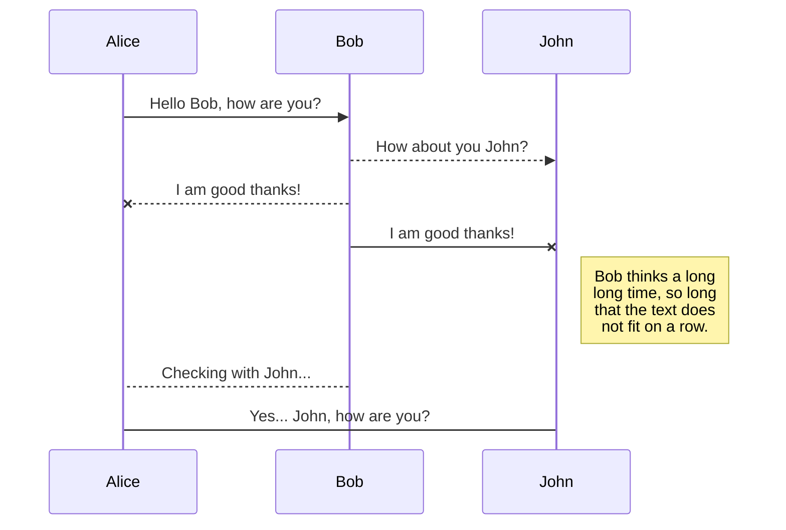
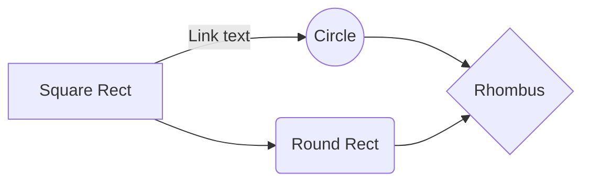

# Sonaqube Dockerfile

    FROM openjdk:8-jdk-alpine
    
    FROM sonarqube
    
    VOLUME /tmp
    
    ARG SERVER_ENV=dev
    
    ENV SERVER_ENV ${SERVER_ENV}
    
    ADD sonar-l10n-zh-plugin-1.21.jar /opt/sonarqube/extensions/plugins/
    
    ENV JAVA_OPTS="-XX:PermSize=1024m -XX:MaxPermSize=512m -Xmx4g -Xms2g"
    
    COPY ./app.jar app.jar
    
    ENTRYPOINT ["java", "-Dspring.profiles.active=${SERVER_ENV}", "-jar","/app.jar"]

# Sonaqube buile.grade

    buildscript {
    	repositories {
    		mavenCentral()
    	}
    
    dependencies {
    
	    classpath 'org.springframework.boot:spring-boot-gradle-plugin:1.5.21.RELEASE'
	   
	    classpath 'se.transmode.gradle:gradle-docker:1.2'
	    
	    classpath "org.sonarsource.scanner.gradle:sonarqube-gradle-plugin:2.6.2"
	    
	    classpath 'org.ajoberstar:gradle-jacoco:0.1.0'
    
    }
    
    }
    
    plugins {
    
    id 'java'
    
    id "org.sonarqube" version "2.5"
    
    }
    
    apply plugin: 'docker'
    
    apply plugin: 'org.springframework.boot'
    
    apply plugin: "org.sonarqube"
    
    apply plugin: 'jacoco'
    
    jacoco {
    
    toolVersion = "0.7.5.201505241946"
    
    }
    
    test {
    
    jacoco {
    
    enabled = true
    
    destinationFile = file("${buildDir}/jacoco/jacoco.exec") // 기본은 ${buildDir}/jacoco/test.exec
    
    }
    
    ignoreFailures = true
    
    }
    
    jacocoTestReport {
    
    reports {
    
    xml.enabled false
    
    csv.enabled false
    
    html.destination file("${buildDir}/jacocoHtml")
    
    }
    
    jacocoClasspath = files
    
    ('../lib/org.jacoco.core-0.7.9.jar',
    
    '../lib/org.jacoco.report-0.7.9.jar',
    
    '../lib/org.jacoco.ant-0.7.9.jar',
    
    '../lib/asm-all-5.2.jar'
    
    )
    
    }
    
    group = 'com.sicc'
    
    version = '0.0.2-SNAPSHOT'
    
    sourceCompatibility = '1.8'
    
    repositories {
    
    mavenCentral()
    
    }
    
    dependencies {
    
    compile 'org.springframework.boot:spring-boot-starter-web'
    
    providedRuntime 'org.springframework.boot:spring-boot-starter-tomcat'
    
    testCompile 'org.springframework.boot:spring-boot-starter-test'
    
    }
    
    jar {
    
    baseName = "SiccDocker"
    
    version = "${version}"
    
    from {
    
    configurations.compile.collect {
    
    it.isDirectory()?it:zipTree(it)
    
    }
    
    }
    
    }
    
    task buildDocker(type: Docker, dependsOn: build) {
    
    applicationName = jar.baseName
    
    dockerfile = file('src/main/docker/Dockerfile')
    
    doFirst {
    
    copy {
    
    from jar
    
    into stageDir
    
    }
    
    }
    
    }
    
    sonarqube {
    
    properties {
    
    property "sonar.projectName", "SiccDocker"
    
    property "sonar.projectKey", "SiccDocker"
    
    property "sonar.jacoco.reportPath", "${project.buildDir}/jacoco/test.exec"
    
    property "sonar.host.url", "http://106.10.38.30:9000"
    
    property "sonar.sources", "src/main/java"
    
    property "sonar.language", "java"
    
    property "sonar.sourceEncoding", "UTF-8"
    
    property "sonar.tests", "src/test/java"
    
    property "sonar.java.binaries", "bin"
    
    property "sonar.java.libraries", "../lib/**/*.jar"
    
    property "sonar.java.test.libraries", "../lib/**/*.jar"
    
    property "sonar.jacoco.reportPaths", "build/jacoco/test.exec"
    
    }
    
    }

## jenkinsfile

    // Jenkins file for Gradle.build
    
    node {
    
    def jarFile = ''
    
    // >>>>> checkout >>>>>>
    
    stage('checkout') {
    
    checkout(
    
    [
    
    $class: 'GitSCM',
    
    additionalCredentials: [],
    
    excludedCommitMessage: '',
    
    excludedRegions: '',
    
    excludedRevprop: '',
    
    excludedUsers: '',
    
    filterChangelog: false,
    
    ignoreDirPropChanges: false,
    
    includedRegions: '',
    
    branches: [[name: '*/master']],
    
    doGenerateSubmoduleConfigurations: false,
    
    extensions: [],
    
    submoduleCfg: [],
    
    userRemoteConfigs: [[credentialsId: '인증키', url: 'git-repo']]
    
    ]
    
    )
    
    }
    
    // >>>>> SonaQube >>>>>
    
    // sonaqube -> marketplcae -> install sonaqube:java
    
    // gradle.build -> update
    
    // jenkins/sonaqube /bash/ conf/sonaqube-sacnner.property update -> run
    
    stage('SonarQube Analysis') {
    
    withSonarQubeEnv('Sonarqube-4.0') {
    
    // sh "chmod +x ./gradlew"
    
    // sh "./gradlew -Pprod clean test sonarqube"
    
    sh "${scannerHome}/bin/sonar-scanner"
    
    }
    
    timeout(time: 10, unit: 'MINUTES') {
    
    waitForQualityGate abortPipeline: false
    
    }
    
    }
    
    // >>>>> JUNIT TEST >>>>>
    
    stage('unit-test') {
    
    sh "chmod +x ./gradlew"
    
    sh "./gradlew clean test --info"
    
    }
    
    // >>>>> gradle init >>>>>
    
    stage('initialize') {
    
    sh "chmod +x ./gradlew"
    
    appName = sh(script: "./gradlew properties -q | grep \"name\" | awk '{print\$2}'", returnStdout: true).trim()
    
    groupName = sh(script: "./gradlew properties -q | grep \"group\" | awk '{print\$2}'", returnStdout: true).trim()
    
    appVersion = sh(script: "./gradlew properties -q | grep \"version\" | awk '{print\$2}'", returnStdout: true).trim()
    
    jarFile = appName + '-' + appVersion + '.jar'
    
    echo jarFile
    
    }
    
    // >>>>> gredle build >>>>>
    
    stage('build') {
    
    sh "./gradlew build"
    
    }
    
    // >>>>> gradle archieve & docker build >>>>>
    
    stage('archieve') {
    
    parallel(
    
    "Archive Artifacts" : {
    
    archiveArtifacts artifacts: '**/build/libs/' + appName + '-' + appVersion + '.jar',
    
    fingerprint: true
    
    },
    
    "Docker ImagePush": {
    
    sh 'mv build/libs/' + jarFile + ' ./app.jar'
    
    sh 'docker container ls -a -f name=app -q | xargs -r docker container stop'
    
    sh 'docker container ls -a -f name=app -q | xargs -r docker container rm'
    
    sh 'docker rmi -f devops-reg.ncp.sicc.co.kr/app'
    
    sh 'docker image build -t app --no-cache .'
    
    sh 'docker tag app devops-reg.ncp.sicc.co.kr/app:release '
    
    sh 'docker push devops-reg.ncp.sicc.co.kr/app:release'
    
    sh 'docker run --name=app -d devops-reg.ncp.sicc.co.kr/app:release .'
    
    }
    
    )
    
    }
    
    }
    
    // Jenkinsfile for POM.xml
    
    // Install [Pipeline: Stage step] on Jenkins
    
    // Set Maven Setting On Jenkins (Maven) for Use Pipeline: Stage step
    
    node {
    
    def jarFile = ''
    
    def mvnHome = tool 'M3'
    
    // >>>>> checkout >>>>>
    
    stage('checkout') {
    
    checkout(
    
    [
    
    $class: 'GitSCM',
    
    additionalCredentials: [],
    
    excludedCommitMessage: '',
    
    excludedRegions: '',
    
    excludedRevprop: '',
    
    excludedUsers: '',
    
    filterChangelog: false,
    
    ignoreDirPropChanges: false,
    
    includedRegions: '',
    
    branches: [[name: '*/master']],
    
    doGenerateSubmoduleConfigurations: false,
    
    extensions: [],
    
    submoduleCfg: [],
    
    userRemoteConfigs: [[credentialsId: '인증키', url: 'git-repo']]
    
    ]
    
    )
    
    }
    
    // >>>>> Maven Install && JunitTest >>>>>
    
    stage('unit-test') {
    
    script {
    
    sh "'${mvnHome}/bin/mvn' -Dmaven.test.failure.ignore clean package"
    
    sh "'${mvnHome}/bin/mvn' -Dintegration-tests.skip=true -Dmaven.test.skip=true -Ddeploy-path=./deploy clean install"
    
    // def pom = readMavenPom file: 'pom.xml'
    
    // get information of pom
    
    // developmentArtifactVersion = "${pom.artifactId}-${pom.version}"
    
    // print pom.version
    
    // print pom.artifactId
    
    // print pom.name
    
    // print pom.groupId
    
    // print pom.description
    
    // execute the unit testing and collect the reports
    
    // archiveArtifacts 'target*//*.jar'
    
    }
    
    }
    
    // >>>>> Archive && Docker Build >>>>>
    
    stage('archieve') {
    
    def pom = readMavenPom file: 'pom.xml'
    
    parallel(
    
    "Archive Artifacts" : {
    
    jarFile = "${pom.artifactId}-${pom.version}.jar"
    
    archiveArtifacts artifacts: 'target/' + jarFile, fingerprint: true
    
    },
    
    "Docker ImagePush": {
    
    sh 'mv target/' + jarFile +' ./mvn2.jar'
    
    sh 'docker image build -t mvn2 .'
    
    sh 'docker tag mvn2 localhost:5000/mvn2:mvn2-1 '
    
    sh 'docker push localhost:5000/mvn2:mvn2-1'
    
    // sh 'docker run -d -p 8888:9999 app .'
    
    }
    
    )
    
    }
    
    }
    
    // Jenkinsfile for POM.xml
    
    // Install Kubernetes On Jenkins
    
    // apt-get update
    
    // apt-get install gettext-base
    
    node {
    
    def jarFile = ''
    
    def script = "; envsubst < deployment.yaml > deployment.yaml"
    
    stage('checkout') {
    
    checkout(
    
    [
    
    $class: 'GitSCM',
    
    additionalCredentials: [],
    
    excludedCommitMessage: '',
    
    excludedRegions: '',
    
    excludedRevprop: '',
    
    excludedUsers: '',
    
    filterChangelog: false,
    
    ignoreDirPropChanges: false,
    
    includedRegions: '',
    
    branches: [[name: '*/master']],
    
    doGenerateSubmoduleConfigurations: false,
    
    extensions: [],
    
    submoduleCfg: [],
    
    userRemoteConfigs: [[credentialsId: '인증키', url: 'repo']]
    
    ]
    
    )
    
    }
    
    stage('unit-test') {
    
    sh "chmod +x ./gradlew"
    
    sh "./gradlew clean test --info"
    
    }
    
    stage('initialize') {
    
    sh "chmod +x ./gradlew"
    
    appName = sh(script: "./gradlew properties -q | grep \"name\" | awk '{print\$2}'", returnStdout: true).trim()
    
    groupName = sh(script: "./gradlew properties -q | grep \"group\" | awk '{print\$2}'", returnStdout: true).trim()
    
    appVersion = sh(script: "./gradlew properties -q | grep \"version\" | awk '{print\$2}'", returnStdout: true).trim()
    
    jarFile = appName + '-' + appVersion + '.jar'
    
    }
    
    stage('build') {
    
    sh "./gradlew build"
    
    }
    
    stage('archieve & docker build') {
    
    parallel(
    
    "Archive Artifacts" : {
    
    archiveArtifacts artifacts: '**/build/libs/' + appName + '-' + appVersion + '.jar'
    
    },
    
    "Docker ImagePush": {
    
    sh 'mv build/libs/' + jarFile + ' ./app.jar'
    
    sh 'docker container ls -a -f name=app -q | xargs -r docker container stop'
    
    sh 'docker container ls -a -f name=app -q | xargs -r docker container rm'
    
    sh 'docker rmi -f devops-reg.ncp.sicc.co.kr/app'
    
    sh 'docker image build -t app --no-cache . '
    
    sh 'docker image tag app devops-reg.ncp.sicc.co.kr/app '
    
    sh 'docker image push devops-reg.ncp.sicc.co.kr/app'
    
    sh 'docker run --name=app -d -p 9091:9091 devops-reg.ncp.sicc.co.kr/app .'
    
    }
    
    )
    
    }
    
    stage('kube') {
    
    sh 'kubectl apply --record -f gs-spring-boot-docker-deployment.yaml'
    
    sh 'kubectl get deployments'
    
    sh 'kubectl get rs'
    
    sh 'kubectl get po'
    
    sh 'kubectl apply -f gs-spring-boot-docker-service.yaml'
    
    sh 'kubectl get service'
    
    sh 'kubectl get svc'
    
    sh 'kubectl set image deployment/gs-spring-boot-docker-deployment gs-spring-boot-docker=dtlabs/gs-spring-boot-docker:2.0 --record'
    
    sh 'kubectl rollout history deployment/gs-spring-boot-docker-deployment'
    
    sh 'kubectl rollout history deployment/gs-spring-boot-docker-deployment --revision=2'
    
    sh 'kubectl rollout undo deployment/gs-spring-boot-docker-deployment'
    
    sh 'kubectl rollout undo deployment/gs-spring-boot-docker-deployment --to-revision=2'
    
    }
    
    }
    
    // jenkins android
    
    node {
    
    def jarFile = ''
    
    //def script = "; envsubst < deployment.yaml > deployment.yaml"
    
    stage('checkout') {
    
    checkout(
    
    [
    
    $class: 'GitSCM',
    
    additionalCredentials: [],
    
    excludedCommitMessage: '',
    
    excludedRegions: '',
    
    excludedRevprop: '',
    
    excludedUsers: '',
    
    filterChangelog: false,
    
    ignoreDirPropChanges: false,
    
    includedRegions: '',
    
    branches: [[name: '*/master']],
    
    doGenerateSubmoduleConfigurations: false,
    
    extensions: [],
    
    submoduleCfg: [],
    
    userRemoteConfigs: [[credentialsId: 'da5d721f-6590-4f89-ba34-4704d29b01df', url: 'http://49.236.136.94:10080/devops/demo.git']]
    
    ]
    
    )
    
    }
    
    stage('unit-test') {
    
    sh "chmod +x ./gradlew"
    
    sh "./gradlew clean test --info"
    
    }
    
    stage('initialize') {
    
    sh "chmod +x ./gradlew"
    
    appName = sh(script: "./gradlew properties -q | grep \"name\" | awk '{print\$2}'", returnStdout: true).trim()
    
    groupName = sh(script: "./gradlew properties -q | grep \"group\" | awk '{print\$2}'", returnStdout: true).trim()
    
    appVersion = sh(script: "./gradlew properties -q | grep \"version\" | awk '{print\$2}'", returnStdout: true).trim()
    
    jarFile = appName + '-' + appVersion + '.jar'
    
    }
    
    stage('build') {
    
    sh "./gradlew build"
    
    }
    
    stage('archieve & docker build') {
    
    parallel(
    
    "Archive Artifacts" : {
    
    archiveArtifacts artifacts: '**/build/libs/' + appName + '-' + appVersion + '.jar'
    
    },
    
    "Docker ImagePush": {
    
    sh 'mv build/libs/' + jarFile + ' ./app.jar'
    
    sh 'docker container ls -a -f name=app -q | xargs -r docker container stop'
    
    sh 'docker container ls -a -f name=app -q | xargs -r docker container rm'
    
    // sh 'docker rmi -f devops-reg.ncp.sicc.co.kr/app'
    
    sh 'docker image build -t app --no-cache . '
    
    sh 'docker login -u pp22shj -p shjk6063'
    
    sh 'docker image tag app pp22shj/registry:app '
    
    sh 'docker image push pp22shj/registry:app'
    
    def script = "; envsubst < kubernetes.yaml > deployment.yaml"
    
    sh 'export APP_NAME=app IMAGE=pp22shj/registry:app ' + script
    
    // sh 'kubectl create namespace test'
    
    sh 'kubectl apply -f deployment.yaml --namespace test '
    
    // sh 'docker run --name=app -d -p 9091:9091 devops-reg.ncp.sicc.co.kr/app .'
    
    }
    
    )
    
    }
    
    // stage('kube') {
    
    // def script = "; envsubst < kubernetes.yaml > deployment.yaml"
    
    // sh 'export APP_NAME=app IMAGE=registry/app ' + script
    
    // sh 'kubectl apply -f deployment.yaml --namespace jiwan '
    
    // // sh 'kubectl get service --namespace jiwan'
    
    // // sh 'kubectl get svc --namespace jiwan'
    
    // // sh 'kubectl get deployments --namespace jiwan'
    
    // // sh 'kubectl get rs --namespace jiwan'
    
    // // sh 'kubectl get po --namespace jiwan'
    
    // // sh 'kubectl set image deployment/gs-spring-boot-docker-deployment gs-spring-boot-docker=dtlabs/gs-spring-boot-docker:2.0 --record'
    
    // // sh 'kubectl rollout history deployment/gs-spring-boot-docker-deployment'
    
    // // sh 'kubectl rollout history deployment/gs-spring-boot-docker-deployment --revision=2'
    
    // // sh 'kubectl rollout undo deployment/gs-spring-boot-docker-deployment'
    
    // // sh 'kubectl rollout undo deployment/gs-spring-boot-docker-deployment --to-revision=2'
    
    // }
    
    // stage('kube') {
    
    // sh 'kubectl apply --record -f gs-spring-boot-docker-deployment.yaml'
    
    // sh 'kubectl get deployments'
    
    // sh 'kubectl get rs'
    
    // sh 'kubectl get po'
    
    // sh 'kubectl apply -f gs-spring-boot-docker-service.yaml'
    
    // sh 'kubectl get service'
    
    // sh 'kubectl get svc'
    
    // sh 'kubectl set image deployment/gs-spring-boot-docker-deployment gs-spring-boot-docker=dtlabs/gs-spring-boot-docker:2.0 --record'
    
    // sh 'kubectl rollout history deployment/gs-spring-boot-docker-deployment'
    
    // sh 'kubectl rollout history deployment/gs-spring-boot-docker-deployment --revision=2'
    
    // sh 'kubectl rollout undo deployment/gs-spring-boot-docker-deployment'
    
    // sh 'kubectl rollout undo deployment/gs-spring-boot-docker-deployment --to-revision=2'
    
    // }
    
    }

## docker-compose.yml

    version: '2'
    services:
    
	    gitlab:
    
		    privileged: true
		    
		    restart: always
		    
		    image: gitlab/gitlab-ce:latest
		    
		    container_name: gitlab
		    
		    environment:
		    
		    GITLAB_OMNIBUS_CONFIG: |
		    
		    external_url 'http://106.10.38.30:10080'
		    
		    depends_on:
		    
		    - postgresql
		    
		    ports:
		    
		    - "10080:10080"
		    
		    - "10022:22"
		    
		    volumes:
		    
		    - /srv/docker/gitlab/gitlab:/home/git/data:Z
    
	    jenkins:
    
		    privileged: true
		    
		    restart: always
		    
		    image: jenkins/jenkins:lts
		    
		    container_name: jenkins
		    
		    user: root
		    
		    environment:
		    
		    JENKINS_HOST_HOME: "/data/jenkins"
		    
		    ports:
		    
		    - 8090:8080
		    
		    volumes:
		    
		    - "/data/jenkins:/var/jenkins_home"
		    
		    - "/var/run/docker.sock:/var/run/docker.sock"
		    
		    - "/usr/bin/docker:/usr/bin/docker"
		    
		    postgresql:
		    
		    privileged: true
		    
		    restart: always
		    
		    container_name: postgres
		    
		    image: postgres:latest
		    
		    ports:
		    
		    - 5432:5432
		    
		    volumes:
		    
		    - "/srv/docker/gitlab/postgresql:/var/lib/postgresql:Z"
		    
		    environment:
		    
		    - POSTGRES_USER=postgres
		    
		    - POSTGRES_PASSWORD=0811
    
	    redmine:
    
		    privileged: true
		    
		    image: redmine
		    
		    container_name: redmine
		    
		    restart: always
		    
		    ports:
		    
		    - 3000:3000
		    
		    environment:
		    
		    - DB_ADAPTER=postgresql
		    
		    - DB_HOST=106.10.38.30
		    
		    - DB_PORT=5432
		    
		    - DB_USER=postgres
		    
		    - DB_PASS=0811
		    
		    - DB_NAME=redmine
    
	    registry:
    
		    privileged: true
		    
		    restart: always
		    
		    image: registry:latest
		    
		    container_name: registry
		    
		    ports:
		    
		    - 5000:5000
		    
		    volumes:
		    
		    - "/srv/docker/registry:/var/lib/registry"
    
	    sonarqube:
    
		    image: sonarqube
		    
		    ports:
		    
		    - "9000:9000"
		    
		    networks:
		    
		    - sonarnet
		    
		    environment:
		    
		    - sonar.jdbc.url=jdbc:postgresql://db:5432/sonar
		    
		    volumes:
		    
		    - sonarqube_conf:/opt/sonarqube/conf
		    
		    - sonarqube_data:/opt/sonarqube/data
		    
		    - sonarqube_extensions:/opt/sonarqube/extensions
		    
		    db:
		    
		    image: postgres
		    
		    networks:
		    
		    - sonarnet
		    
		    environment:
		    
		    - POSTGRES_USER=sonar
		    
		    - POSTGRES_PASSWORD=sonar
		    
		    volumes:
		    
		    - postgresql:/var/lib/postgresql
		    
		    - postgresql_data:/var/lib/postgresql/data
    
    networks:
    
    sonarnet:
    
    driver: bridge
    
    volumes:
    
    sonarqube_conf:
    
    sonarqube_data:
    
    sonarqube_extensions:
    
    postgresql:
    
    postgresql_data:

# Removing All Unused Objects :

    $ docker system prune
    
    $ docker system prune --volumes

# Removing Docker Containers:

    $ docker container ls -a
    
    $ docker container rm [container name]

# Remove all stopped containers:

    $ docker container ls -a --filter status=exited --filter status=created
    
    $ docker container prune
    
    $ docker container prune --filter "until=12h"
    
    $ docker container stop $(docker container ls -aq)
    
    $ docker container rm $(docker container ls -aq)

# Removing Docker Images :

    $ docker image ls
    
    $ docker image rm [image name]
    
    $ docker rmi $(docker images -f dangling=true -q)
    
    $ docker image prune
    
    $ docker image prune -a
    
    $ docker image prune -a --filter "until=12h"

# Removing Docker Volumes :

    $ docker volume ls
    
    $ docker volume rm [volume name]
    
    $ docker volume prune

# Removing Docker Networks :

    $ docker network ls
    
    $ docker network rm [volume name]
    
    $ docker network prune
    
    $ docker network prune -a --filter "until=12h"

# Docker repository

    $ docker tag image username/repository:tagname
    
    $ docker push username/repository:tagname
    
    $ docker pull username/repository:tagname

## 1차 사내교육 자료

    0. Pre-Install For CentOS
    
    yum -y update && upgrade
    
    // ==> update && upgrade centos
    
    yum install -y java-1.8.0-openjdk.x86_64
    
    // ==> install openjdk
    
    1. Docker Install
    
    yum install -y yum-utils device-mapper-persistent-data lvm2
    
    // ==> pre-install for install docker
    
    yum-config-manager --add-repo https://download.docker.com/linux/centos/docker-ce.repo
    
    // ==> setting docker-repository
    
    yum -y install docker-ce
    
    // ==> docker install latest version
    
    systemctl enable docker && systemctl start docker
    
    // ==> enable && start docker
    
    2. docker-compose Install(install system)
    
    sudo curl -L "https://github.com/docker/compose/releases/download/1.24.1/docker-compose-$(uname -s)-$(uname -m)" -o /usr/local/bin/docker-compose
    
    // ==> docker-compose install
    
    sudo chmod +x /usr/local/bin/docker-compose
    
    // ==> docker-compose authorization
    
    3. Install GitLab/Jenkins/Postgresql/Redmine/Docker-Registry With Docker-Compose
    
    // ==> to install Devops tools with docker-compose which enable to install easy
    
    version: '2'
    
    services:
    
    gitlab:
    
    privileged: true
    
    restart: always
    
    image: gitlab/gitlab-ce:latest
    
    container_name: gitlab
    
    environment:
    
    GITLAB_OMNIBUS_CONFIG: |
    
    external_url 'http://210.89.189.207:10080'
    
    depends_on:
    
    - postgresql
    
    ports:
    
    - "10080:10080"
    
    - "10022:22"
    
    volumes:
    
    - "/srv/docker/gitlab/gitlab:/home/git/data:Z"
    
    jenkins:
    
    privileged: true
    
    restart: always
    
    image: jenkins/jenkins:lts
    
    container_name: jenkins
    
    user: root
    
    environment:
    
    JENKINS_HOST_HOME: "/data/jenkins"
    
    ports:
    
    - "8090:8080"
    
    volumes:
    
    - "/data/jenkins:/var/jenkins_home"
    
    - "/var/run/docker.sock:/var/run/docker.sock"
    
    - "/usr/bin/docker:/usr/bin/docker"
    
    postgresql:
    
    privileged: true
    
    restart: always
    
    container_name: postgres
    
    image: postgres:latest
    
    ports:
    
    - "5432:5432"
    
    volumes:
    
    - "/srv/docker/gitlab/postgresql:/var/lib/postgresql:Z"
    
    environment:
    
    - POSTGRES_USER=postgres
    
    - POSTGRES_PASSWORD=0811
    
    redmine:
    
    privileged: true
    
    image: redmine
    
    container_name: redmine
    
    restart: always
    
    ports:
    
    - "3000:3000"
    
    environment:
    
    - DB_ADAPTER=postgresql
    
    - DB_HOST=210.89.189.207
    
    - DB_PORT=5432
    
    - DB_USER=postgres
    
    - DB_PASS=0811
    
    - DB_NAME=redmine
    
    registry:
    
    privileged: true
    
    restart: always
    
    image: registry:latest
    
    container_name: registry
    
    ports:
    
    - "5000:5000"
    
    volumes:
    
    - "/srv/docker/registry:/var/lib/registry"
    
    [Docker Common Command]
    
    docker ps
    
    // ==> check the container
    
    docker ps -a
    
    // ==> check all container list
    
    docker images
    
    // ==> check images
    
    docker-compose up
    
    // ==> setup and run docker-compose with logs
    
    docker-compose up -d
    
    // ==> setup and run docker-compose with background
    
    docker-compose(docker) stop(down)
    
    // ==> shut-down docker
    
    docker stop(down) [container_name]
    
    // ==> stop container
    
    docker restart [container_name]
    
    // ==> restart container
    
    4. Jenkinsfile =>> Checkout SCM =>> Unit Test => Gradle Build =>> Make Archieve && Docker Build =>> Docker Run =>> Check Server OutPut
    
    // ==> type code with groovy to make pipeline
    
    node {
    
    def jarFile = ''
    
    stage('checkout') {
    
    checkout(
    
    [
    
    $class: 'GitSCM',
    
    additionalCredentials: [],
    
    excludedCommitMessage: '',
    
    excludedRegions: '',
    
    excludedRevprop: '',
    
    excludedUsers: '',
    
    filterChangelog: false,
    
    ignoreDirPropChanges: false,
    
    includedRegions: '',
    
    branches: [[name: '*/master']],
    
    doGenerateSubmoduleConfigurations: false,
    
    extensions: [],
    
    submoduleCfg: [],
    
    userRemoteConfigs: [[credentialsId: '인증키', url: 'http://210.89.189.207:10080/root/education.git']]
    
    ]
    
    )
    
    }
    
    stage('unit-test') {
    
    sh "chmod +x ./gradlew"
    
    sh "./gradlew clean test --info"
    
    }
    
    stage('initialize') {
    
    sh "chmod +x ./gradlew"
    
    appName = sh(script: "./gradlew properties -q | grep \"name\" | awk '{print\$2}'", returnStdout: true).trim()
    
    groupName = sh(script: "./gradlew properties -q | grep \"group\" | awk '{print\$2}'", returnStdout: true).trim()
    
    appVersion = sh(script: "./gradlew properties -q | grep \"version\" | awk '{print\$2}'", returnStdout: true).trim()
    
    jarFile = appName + '-' + appVersion + '.jar'
    
    }
    
    stage('build') {
    
    sh "./gradlew build"
    
    }
    
    stage('archieve & docker build') {
    
    parallel(
    
    "Archive Artifacts" : {
    
    archiveArtifacts artifacts: '**/build/libs/' + appName + '-' + appVersion + '.jar'
    
    },
    
    "Docker ImagePush": {
    
    sh 'mv build/libs/' + jarFile + ' ./app.jar'
    
    sh 'docker container ls -a -f name=app -q | xargs -r docker container stop'
    
    sh 'docker container ls -a -f name=app -q | xargs -r docker container rm'
    
    sh 'docker rmi -f localhost:5000/app'
    
    sh 'docker image build -t app --no-cache . '
    
    sh 'docker image tag app localhost:5000/app '
    
    sh 'docker image push localhost:5000/app'
    
    sh 'docker run --name=app -d -p 9091:9091 localhost:5000/app .'
    
    }
    
    )
    
    }
    
    }

# registry repository name

    http://host:port/v2/_catalog

# registry tag list

    http://host:port/v2/app/tags/list

# 실습 프로젝트 URL

    URL : https://github.com/devops-sicc/edusicc-step1.git
    
    ID : devops-sicc
    
    PW : jiwan8985@@
    
    E-MAIL : jiwan8985@sicc.co.kr

## Ingrss 생성 guide

    apiVersion: extensions/v1beta1
    
    kind: Ingress
    
    metadata:
    
	    name: test-ingress
	    
	    annotations:
    
		    kubernetes.io/ingress.class: nginx
		    
		    ingress.kubernetes.io/rewrite-target: /
    
    spec:
    
	    rules:
    
	    - host: devops-kibana.ncp.sicc.co.kr
    
		    http:
    
			    paths:
    
			    - path: /
    
			    backend:
    
				    serviceName: elk-kibana
    
				    servicePort: 'http'

# kubernetes-master-slave 생성 가이드 1

    0. Pre-Install
    
    yum update && upgrade
    
    yum search openjdk
    
    yum install java-1.8.0-openjdk.x86_64
    
    1. Docker-Install
    
    yum install -y yum-utils device-mapper-persistent-data lvm2
    
    yum-config-manager --add-repo https://download.docker.com/linux/centos/docker-ce.repo
    
    yum -y install docker-ce
    
    systemctl enable docker.service
    
    systemctl start docker.service
    
    systemctl status docker.service
    
    2. Docker-Compose Install
    
    sudo curl -L "https://github.com/docker/compose/releases/download/1.24.1/docker-compose-$(uname -s)-$(uname -m)" -o /usr/local/bin/docker-compose
    
    sudo chmod +x /usr/local/bin/docker-compose
    
    3. Kubernetes Install
    
    cat <<EOF > /etc/yum.repos.d/kubernetes.repo
    
    [kubernetes]
    
    name=Kubernetes
    
    baseurl=https://packages.cloud.google.com/yum/repos/kubernetes-el7-x86_64
    
    enabled=1
    
    gpgcheck=1
    
    repo_gpgcheck=1
    
    gpgkey=https://packages.cloud.google.com/yum/doc/yum-key.gpg https://packages.cloud.google.com/yum/doc/rpm-package-key.gpg
    
    EOF
    
    yum install -y kubectl
    
    4. Helm Install
    
    wget https://storage.googleapis.com/kubernetes-helm/helm-v2.13.1-linux-amd64.tar.gz
    
    tar zxvf helm-v2.13.1-linux-amd64.tar.gz
    
    sudo mv linux-amd64/helm /usr/local/bin/helm
    
    helm init : Tiller Install
    
    5. Skaffold Install
    
    curl -Lo skaffold https://storage.googleapis.com/skaffold/releases/latest/skaffold-darwin-amd64
    
    chmod +x skaffold
    
    sudo mv skaffold /usr/local/bin
    
    vim /etc/hosts
    
    127.0.0.1 localhost localhost.localdomain localhost4 localhost4.localdomain4
    
    ::1 localhost localhost.localdomain localhost6 localhost6.localdomain6
    
    10.41.172.151 devops-jw
    
    10.41.178.164 devops-test

## Kubernetes-master-slave 생성 가이드 2

    1. System update
    
    sudo yum update -y
    
    2. Install and Setup Docker
    
    sudo yum install -y docker-ce-18.09
    
    sudo systemctl enable docker && sudo systemctl start docker
    
    sudo docker version
    
    3. Install Kubernetes packages
    
    sudo bash -c 'cat <<EOF > /etc/yum.repos.d/kubernetes.repo
    
    [kubernetes]
    
    name=Kubernetes
    
    baseurl=https://packages.cloud.google.com/yum/repos/kubernetes-el7-x86_64
    
    enabled=1
    
    gpgcheck=1
    
    repo_gpgcheck=1
    
    gpgkey=https://packages.cloud.google.com/yum/doc/yum-key.gpg https://packages.cloud.google.com/yum/doc/rpm-package-key.gpg
    
    exclude=kube*
    
    EOF'
    
    4. Disable SELinux
    
    sudo setenforce 0
    
    sudo sed -i 's/^SELINUX=enforcing$/SELINUX=permissive/' /etc/selinux/config
    
    swapoff -a
    
    5. Install Kubernetes
    
    sudo yum install -y kubelet kubeadm kubectl --disableexcludes=kubernetes
    
    sudo systemctl enable kubelet && sudo systemctl start kubelet
    
    6. Set IPTables settings
    
    sudo bash -c cat <<EOF > /etc/sysctl.d/k8s.conf
    
    net.bridge.bridge-nf-call-ip6tables = 1
    
    net.bridge.bridge-nf-call-iptables = 1
    
    EOF
    
    sudo sysctl --system
    
    sudo lsmod | grep br_netfilter
    
    sudo kubeadm config images pull
    
    vim etc/hosts
    
    127.0.0.1 localhost localhost.localdomain localhost4 localhost4.localdomain4
    
    ::1 localhost localhost.localdomain localhost6 localhost6.localdomain6
    
    10.41.29.144 dev-mast
    
    10.41.179.161 dev-worker
    
    7. Master Node
    
    sudo kubeadm init --pod-network-cidr=10.244.0.0/16
    
    mkdir -p $HOME/.kube
    
    sudo cp -i /etc/kubernetes/admin.conf $HOME/.kube/config
    
    sudo chown $(id -u):$(id -g) $HOME/.kube/config
    
    kubectl apply -f https://raw.githubusercontent.com/coreos/flannel/a70459be0084506e4ec919aa1c114638878db11b/Documentation/kube-flannel.yml
    
    8. Worker node
    
    vim /usr/lib/systemd/system/docker.service
    
    ExecStart=/usr/bin/dockerd-current
    
    --add-runtime docker-runc=/usr/libexec/docker/docker-runc-current
    
    --default-runtime=docker-runc
    
    --exec-opt native.cgroupdriver=systemd // 이것만 수정해준다.( --> To change cgroupfs )
    
    --userland-proxy-path=/usr/libexec/docker/docker-proxy-current
    
    --init-path=/usr/libexec/docker/docker-init-current
    
    --seccomp-profile=/etc/docker/seccomp.json \
    
    sudo kubeadm join 10.41.29.144:6443 --token khm95w.mo0wwenu2o9hglls \
    
    --discovery-token-ca-cert-hash sha256:aeb0ca593b63c8d674719858fd2397825825cebc552e3c165f00edb9671d6e32 --v=2(skipping verify)
    
    systemctl daemon-reload
    
    systemctl restart docker
    
    kubectl --kubeconfig=kubelet.conf get nodes(check worker, master Node status ready)
    
    9. Master Node
    
    kubectl label node dev-woreker node-role.kubernetes.io/worker=worker
    
    kubectl get nodes(check worker, master Node status ready)
    
    kubectl apply -f xxx.yaml
    
    10. create service on kubectl
    
    Create a Namespace
    
    Create a deployment yaml and deploy it.
    
    Create a service yaml and deploy it.
    
    Access the Jenkins application on a Node Port.
    
    11. setup jenkins on kubectl
    
    kubectl create ns jenkins // create Namespace
    
    vim jenkins-deployment.yaml // create deployment file
    
    >>>>>>>>>>>>>>>>>>>>>>>>>>>>>jenkins-deployment.yaml>>>>>>>>>>>>>>>>>>>>>>>>>>>>>>>>>>>>>
    
    apiVersion: extensions/v1beta1
    
    kind: Deployment
    
    metadata:
    
    name: jenkins-deployment
    
    spec:
    
    replicas: 1
    
    selector:
    
    matchLabels:
    
    app: jenkins
    
    template:
    
    metadata:
    
    labels:
    
    app: jenkins
    
    spec:
    
    containers:
    
    - name: jenkins
    
    image: jenkins:2.60.3
    
    ports:
    
    - containerPort: 8080
    
    >>>>>>>>>>>>>>>>>>>>>>>>>>>>>jenkins-deployment.yaml>>>>>>>>>>>>>>>>>>>>>>>>>>>>>>>>>>>>>
    
    kubectl create -f jenkins-deployment.yaml --namespace=jenkins // create jenkins deployment
    
    kubectl describe deployments --namespace=jenkins // get deployment details
    
    vim jenkins-service.yaml // create jenkins service
    
    >>>>>>>>>>>>>>>>>>>>>>>>>>>>>jenkins-service.yaml>>>>>>>>>>>>>>>>>>>>>>>>>>>>>>>>>>>>>
    
    apiVersion: v1
    
    kind: Service
    
    metadata:
    
    name: jenkins
    
    spec:
    
    type: NodePort
    
    ports:
    
    - port: 8080
    
    targetPort: 8080
    
    nodePort: 30000
    
    selector:
    
    app: jenkins
    
    >>>>>>>>>>>>>>>>>>>>jenkins-service.yaml>>>>>>>>>>>>>>>>>>>>>>>>>>>>>>>>>>>>>
    
    kubectl create -f jenkins-service.yaml --namespace=jenkins // create jenkins service
    
    http://10.41.29.144:3000 // connect
    
    kubectl get pods --namespace=jenkins
    
    kubectl logs jenkins-deployment-868cc579df-jxq5m --namespace=jenkins // to get initialAdminPassword
    
    12. helm
    
    helm install --name my-release stable/jenkins
    
    helm status my-release
    
    helm delete --purge my-release
    
    helm list
    
    kubectl get -n kube-system secrets,sa,clusterrolebinding -o name|grep tiller|xargs kubectl -n kube-system delete
    
    kubectl get all -n kube-system -l app=helm -o name|xargs kubectl delete -n kube-system

## Kubectl 자동완성

source <(kubectl completion bash) # bash-completion 패키지를 먼저 설치한 후, bash의 자동 완성을 현재 셸에 설정한다

echo "source <(kubectl completion bash)" >> ~/.bashrc # 자동 완성을 bash 셸에 영구적으로 추가한다

2. Kubectl 컨텍스트

kubectl config view # 병합된 kubeconfig 설정을 표시한다.

# 동시에 여러 kubeconfig 파일을 사용하고 병합된 구성을 확인한다

KUBECONFIG=~/.kube/config:~/.kube/kubconfig2

kubectl config view

# e2e 사용자의 암호를 확인한다

kubectl config view -o jsonpath='{.users[?(@.name == "e2e")].user.password}'

kubectl config view -o jsonpath='{.users[].name}' # 사용자 리스트 조회

kubectl config get-contexts # 컨텍스트 리스트 출력

kubectl config current-context # 현재 컨텍스트 출력

kubectl config use-context my-cluster-name # my-cluster-name를 기본 컨텍스트로 설정

# 기본 인증을 지원하는 새로운 클러스터를 kubeconf에 추가한다

kubectl config set-credentials kubeuser/foo.kubernetes.com --username=kubeuser --password=kubepassword

# 해당 컨텍스트에서 모든 후속 kubectl 커맨드에 대한 네임스페이스를 영구적으로 저장한다

kubectl config set-context --current --namespace=ggckad-s2

# 특정 사용자와 네임스페이스를 사용하는 컨텍스트 설정

kubectl config set-context gce --user=cluster-admin --namespace=foo \

&& kubectl config use-context gce

kubectl config unset users.foo # foo 사용자 삭제

3. 오브젝트 생성

# kubectl apply를 실행하여 클러스터에 리소스를 생성하고 업데이트

kubectl apply -f ./my-manifest.yaml # 리소스(들) 생성

kubectl apply -f ./my1.yaml -f ./my2.yaml # 여러 파일로 부터 생성

kubectl apply -f ./dir # dir 내 모든 매니페스트 파일에서 리소스(들) 생성

kubectl apply -f https://git.io/vPieo # url로부터 리소스(들) 생성

kubectl create deployment nginx --image=nginx # nginx 단일 인스턴스를 시작

kubectl explain pods,svc # 파드와 서비스 매니페스트 문서를 조회

# stdin으로 다수의 YAML 오브젝트 생성

cat <<EOF | kubectl apply -f -

apiVersion: v1

kind: Pod

metadata:

name: busybox-sleep

spec:

containers:

- name: busybox

image: busybox

args:

- sleep

- "1000000"

---

apiVersion: v1

kind: Pod

metadata:

name: busybox-sleep-less

spec:

containers:

- name: busybox

image: busybox

args:

- sleep

- "1000"

EOF

# 여러 개의 키로 시크릿 생성

cat <<EOF | kubectl apply -f -

apiVersion: v1

kind: Secret

metadata:

name: mysecret

type: Opaque

data:

password: $(echo -n "s33msi4" | base64 -w0)

username: $(echo -n "jane" | base64 -w0)

EOF

4. 리소스 조회

# 기본 출력을 위한 Get 커맨드

kubectl get services # 네임스페이스 내 모든 서비스의 목록 조회

kubectl get pods --all-namespaces # 모든 네임스페이스 내 모든 파드의 목록 조회

kubectl get pods -o wide # 네임스페이스 내 모든 파드의 상세 목록 조회

kubectl get deployment my-dep # 특정 디플로이먼트의 목록 조회

kubectl get pods --include-uninitialized # 초기화되지 않은 것을 포함하여 네임스페이스 내 모든 파드의 목록 조회

kubectl get pod my-pod -o yaml # 파드의 YAML 조회

kubectl get pod my-pod -o yaml --export # 클러스터 명세 없이 파드의 YAML 조회

# 상세 출력을 위한 Describe 커맨드

kubectl describe nodes my-node

kubectl describe pods my-pod

kubectl get services --sort-by=.metadata.name # Name으로 정렬된 서비스의 목록 조회

# 재시작 횟수로 정렬된 파드의 목록 조회

kubectl get pods --sort-by='.status.containerStatuses[0].restartCount'

# test 네임스페이스 내 파드 목록을 용량으로 정렬해서 조회

kubectl get pods -n test --sort-by=.spec.capacity.storage

# app=cassandra 레이블을 가진 모든 파드의 레이블 버전 조회

kubectl get pods --selector=app=cassandra -o \

jsonpath='{.items[*].metadata.labels.version}'

# 모든 워커 노드 조회 (셀렉터를 사용하여 'node-role.kubernetes.io/master'

# 으로 명명된 라벨의 결과를 제외)

kubectl get node --selector='!node-role.kubernetes.io/master'

# 네임스페이스의 모든 실행 중인 파드를 조회

kubectl get pods --field-selector=status.phase=Running

# 모든 노드의 외부IP를 조회

kubectl get nodes -o jsonpath='{.items[*].status.addresses[?(@.type=="ExternalIP")].address}'

# 특정 RC에 속해있는 파드 이름의 목록 조회

# "jq" 커맨드는 jsonpath를 사용하는 매우 복잡한 변환에 유용하다. https://stedolan.github.io/jq/ 에서 확인할 수 있다.

sel=${$(kubectl get rc my-rc --output=json | jq -j '.spec.selector | to_entries | .[] | "\(.key)=\(.value),"')%?}

echo $(kubectl get pods --selector=$sel --output=jsonpath={.items..metadata.name})

# 모든 파드(또는 레이블을 지원하는 다른 쿠버네티스 오브젝트)의 레이블 조회

# 마찬가지로 "jq"를 사용

for item in $( kubectl get pod --output=name); do printf "Labels for %s\n" "$item" | grep --color -E '[^/]+$' && kubectl get "$item" --output=json | jq -r -S '.metadata.labels | to_entries | .[] | " \(.key)=\(.value)"' 2>/dev/null; printf "\n"; done

# 혹은 이 명령어를 파드와 연관된 모든 레이블을 조회하는데 사용할 수 있다.

kubectl get pods --show-labels

# 어떤 노드가 준비됐는지 확인

JSONPATH='{range .items[*]}{@.metadata.name}:{range @.status.conditions[*]}{@.type}={@.status};{end}{end}' \

&& kubectl get nodes -o jsonpath="$JSONPATH" | grep "Ready=True"

# 파드에 의해 현재 사용되고 있는 모든 시크릿 목록 조회

kubectl get pods -o json | jq '.items[].spec.containers[].env[]?.valueFrom.secretKeyRef.name' | grep -v null | sort | uniq

# 타임스탬프로 정렬된 이벤트 목록 조회

kubectl get events --sort-by=.metadata.creationTimestamp

5. 리소스 업데이트

kubectl set image deployment/frontend www=image:v2 # "frontend" 디플로이먼트의 "www" 컨테이너 이미지를 업데이트하는 롤링 업데이트

kubectl rollout history deployment/frontend # 현 리비전을 포함한 디플로이먼트의 이력을 체크

kubectl rollout undo deployment/frontend # 이전 디플로이먼트로 롤백

kubectl rollout undo deployment/frontend --to-revision=2 # 특정 리비전으로 롤백

kubectl rollout status -w deployment/frontend # 완료될 때까지 "frontend" 디플로이먼트의 롤링 업데이트 상태를 감시

# 버전 1.11 부터 사용 중단

kubectl rolling-update frontend-v1 -f frontend-v2.json # (사용중단) frontend-v1 파드의 롤링 업데이트

kubectl rolling-update frontend-v1 frontend-v2 --image=image:v2 # (사용중단) 리소스 이름 변경과 이미지 업데이트

kubectl rolling-update frontend --image=image:v2 # (사용중단) 프론트엔드의 파드 이미지 업데이트

kubectl rolling-update frontend-v1 frontend-v2 --rollback # (사용중단) 진행중인 기존 롤아웃 중단

cat pod.json | kubectl replace -f - # std로 전달된 JSON을 기반으로 파드 교체

# 리소스를 강제 교체, 삭제 후 재생성함. 이것은 서비스를 중단시킴.

kubectl replace --force -f ./pod.json

# 복제된 nginx를 위한 서비스를 생성한다. 80 포트로 서비스하고, 컨테이너는 8000 포트로 연결한다.

kubectl expose rc nginx --port=80 --target-port=8000

# 단일-컨테이너 파드의 이미지 버전(태그)을 v4로 업데이트

kubectl get pod mypod -o yaml | sed 's/\(image: myimage\):.*$/\1:v4/' | kubectl replace -f -

kubectl label pods my-pod new-label=awesome # 레이블 추가

kubectl annotate pods my-pod icon-url=http://goo.gl/XXBTWq # 어노테이션 추가

kubectl autoscale deployment foo --min=2 --max=10 # 디플로이먼트 "foo" 오토스케일

6. 리소스 패치

kubectl patch node k8s-node-1 -p '{"spec":{"unschedulable":true}}' # 노드를 부분적으로 업데이트

# 컨테이너의 이미지를 업데이트. 병합(merge) 키이므로, spec.containers[*].name이 필요.

kubectl patch pod valid-pod -p '{"spec":{"containers":[{"name":"kubernetes-serve-hostname","image":"new image"}]}}'

# 위치 배열을 이용한 json 패치를 사용하여, 컨테이너의 이미지를 업데이트.

kubectl patch pod valid-pod --type='json' -p='[{"op": "replace", "path": "/spec/containers/0/image", "value":"new image"}]'

# 위치 배열을 이용한 json 패치를 사용하여 livenessProbe 디플로이먼트 비활성화.

kubectl patch deployment valid-deployment --type json -p='[{"op": "remove", "path": "/spec/template/spec/containers/0/livenessProbe"}]'

# 위치 배열에 새 요소 추가

kubectl patch sa default --type='json' -p='[{"op": "add", "path": "/secrets/1", "value": {"name": "whatever" } }]'

7. 리소스 편집

kubectl edit svc/docker-registry # docker-registry라는 서비스 편집

KUBE_EDITOR="nano" kubectl edit svc/docker-registry # 다른 편집기 사용

8. 리소스 스케일링

kubectl scale --replicas=3 rs/foo # 'foo'라는 레플리카 셋을 3으로 스케일

kubectl scale --replicas=3 -f foo.yaml # "foo.yaml"에 지정된 리소스의 크기를 3으로 스케일

kubectl scale --current-replicas=2 --replicas=3 deployment/mysql # mysql이라는 디플로이먼트의 현재 크기가 2인 경우, mysql을 3으로 스케일

kubectl scale --replicas=5 rc/foo rc/bar rc/baz # 여러 개의 레플리케이션 컨트롤러 스케일

9. 리소스 삭제

kubectl delete -f ./pod.json # pod.json에 지정된 유형 및 이름을 사용하여 파드 삭제

kubectl delete pod,service baz foo # "baz", "foo"와 동일한 이름을 가진 파드와 서비스 삭제

kubectl delete pods,services -l name=myLabel # name=myLabel 라벨을 가진 파드와 서비스 삭제

kubectl delete pods,services -l name=myLabel --include-uninitialized # 초기화되지 않은 것을 포함하여, name=myLabel 라벨을 가진 파드와 서비스 삭제

kubectl -n my-ns delete po,svc --all # 초기화되지 않은 것을 포함하여, my-ns 네임스페이스 내 모든 파드와 서비스 삭제

# awk pattern1 또는 pattern2에 매칭되는 모든 파드 삭제

kubectl get pods -n mynamespace --no-headers=true | awk '/pattern1|pattern2/{print $1}' | xargs kubectl delete -n mynamespace pod

10. 실행중인 파드와 상호 작용

kubectl logs my-pod # 파드 로그(stdout) 덤프

kubectl logs -l name=myLabel # name이 myLabel인 파드 로그 덤프 (stdout)

kubectl logs my-pod --previous # 컨테이너의 이전 인스턴스 생성에 대한 파드 로그(stdout) 덤프

kubectl logs my-pod -c my-container # 파드 로그(stdout, 멀티-컨테이너 경우) 덤프

kubectl logs -l name=myLabel -c my-container # name이 myLabel인 파드 로그 덤프 (stdout)

kubectl logs my-pod -c my-container --previous # 컨테이너의 이전 인스턴스 생성에 대한 파드 로그(stdout, 멀티-컨테이너 경우) 덤프

kubectl logs -f my-pod # 실시간 스트림 파드 로그(stdout)

kubectl logs -f my-pod -c my-container # 실시간 스트림 파드 로그(stdout, 멀티-컨테이너 경우)

kubectl logs -f -l name=myLabel --all-containers # name이 myLabel인 모든 파드의 로그 스트리밍 (stdout)

kubectl run -i --tty busybox --image=busybox -- sh # 대화형 셸로 파드를 실행

kubectl attach my-pod -i # 실행중인 컨테이너에 연결

kubectl port-forward my-pod 5000:6000 # 로컬 머신의 5000번 포트를 리스닝하고, my-pod의 6000번 포트로 전달

kubectl exec my-pod -- ls / # 기존 파드에서 명령 실행(한 개 컨테이너 경우)

kubectl exec my-pod -c my-container -- ls / # 기존 파드에서 명령 실행(멀티-컨테이너 경우)

kubectl top pod POD_NAME --containers # 특정 파드와 해당 컨테이너에 대한 메트릭 표시

11. 노드, 클러스터와 상호 작용

kubectl cordon my-node # my-node를 스케줄링할 수 없도록 표기

kubectl drain my-node # 유지 보수를 위해서 my-node를 준비 상태로 비움

kubectl uncordon my-node # my-node를 스케줄링할 수 있도록 표기

kubectl top node my-node # 주어진 노드에 대한 메트릭 표시

kubectl cluster-info # 마스터 및 서비스의 주소 표시

kubectl cluster-info dump # 현재 클러스터 상태를 stdout으로 덤프

kubectl cluster-info dump --output-directory=/path/to/cluster-state # 현재 클러스터 상태를 /path/to/cluster-state으로 덤프

# key와 effect가 있는 테인트(taint)가 이미 존재하면, 그 값이 지정된 대로 대체된다.

kubectl taint nodes foo dedicated=special-user:NoSchedule

12. 리소스 타입

kubectl api-resources

kubectl api-resources --namespaced=true # 네임스페이스를 가지는 모든 리소스

kubectl api-resources --namespaced=false # 네임스페이스를 가지지 않는 모든 리소스

kubectl api-resources -o name # 모든 리소스의 단순한 (리소스 이름 만) 출력

kubectl api-resources -o wide # 모든 리소스의 확장된 ("wide"로 알려진) 출력

kubectl api-resources --verbs=list,get # "list"와 "get"의 요청 동사를 지원하는 모든 리소스 출력

kubectl api-resources --api-group=extensions # "extensions" API 그룹의 모든 리소스

13. 출력 형식

# 쉼표로 구분된 사용자 정의 열 목록을 사용하여 테이블 출력

-o=custom-columns=<명세>

# <파일명>파일에서 사용자 정의 열 템플릿을 사용하여 테이블 출력

-o=custom-columns-file=<파일명>

# JSON 형식의 API 오브젝트 출력

-o=json

# jsonpath 표현식에 정의된 필드 출력

-o=jsonpath=<템플릿>

# <파일명> 파일에서 jsonpath 표현식에 정의된 필드 출력

-o=jsonpath-file=<파일명>

# 리소스 명만 출력하고 그 외에는 출력하지 않음

-o=name

# 추가 정보가 포함된 일반-텍스트 형식으로 출력하고, 파드의 경우 노드 명이 포함

-o=wide

# YAML 형식의 API 오브젝트 출력

-o=yaml

14. Kubectl 출력 로그 상세 레벨(verbosity)과 디버깅

# 일반적으로 클러스터 운영자(operator)에게 항상 보여지게 하기에는 유용함.

--v=0

# 자세한 정보를 원하지 않는 경우, 적절한 기본 로그 수준.

--v=1

# 서비스와 시스템의 중요한 변화와 관련이있는 중요한 로그 메시지에 대한 유용한 정상 상태 정보.

--v=2

# 변경 사항에 대한 확장 정보.

--v=3

# 디버그 수준 상세화.

--v=4

# 요청한 리소스를 표시.

--v=6

# HTTP 요청 헤더를 표시.

--v=7

# HTTP 요청 내용을 표시.

--v=8

# 내용을 잘라 내지 않고 HTTP 요청 내용을 표시.

--v=9

14. Common Commands

# Run curl test temporarily

kubectl run --rm mytest --image=yauritux/busybox-curl -it

# Run wget test temporarily

kubectl run --rm mytest --image=busybox -it

# Run nginx deployment with 2 replicas

kubectl run my-nginx --image=nginx --replicas=2 --port=80

# Run nginx pod and expose it

kubectl run my-nginx --restart=Never --image=nginx --port=80 --expose

# Run nginx deployment and expose it

kubectl run my-nginx --image=nginx --port=80 --expose

# Set namespace preference

kubectl config set-context <context_name> --namespace=<ns_name>

# List pods with nodes info

kubectl get pod -o wide

# List everything

kubectl get all --all-namespaces

# Get all services

kubectl get service --all-namespaces

# Get all deployments

kubectl get deployments --all-namespaces

# Show nodes with labels

kubectl get nodes --show-labels

# Get resources with json output

kubectl get pods --all-namespaces -o json

# Validate yaml file with dry run

kubectl create --dry-run --validate -f pod-dummy.yaml

# Start a temporary pod for testing

kubectl run --rm -i -t --image=alpine test-$RANDOM -- sh

# kubectl run shell command

kubectl exec -it mytest -- ls -l /etc/hosts

# Get system conf via configmap

kubectl -n kube-system get cm kubeadm-config -o yaml

# Get deployment yaml

kubectl -n denny-websites get deployment mysql -o yaml

# Explain resource

kubectl explain pods, kubectl explain svc

# Watch pods

kubectl get pods -n wordpress --watch

# Query healthcheck endpoint

curl -L http://127.0.0.1:10250/healthz

# Open a bash terminal in a pod

kubectl exec -it storage sh

# Check pod environment variables

kubectl exec redis-master-ft9ex env

# Enable kubectl shell autocompletion

echo "source <(kubectl completion bash)" >>~/.bashrc, and reload

# Use minikube dockerd in your laptop

eval $(minikube docker-env), No need to push docker hub any more

# Kubectl apply a folder of yaml files

kubectl apply -R -f .

# Get services sorted by name

kubectl get services –sort-by=.metadata.name

# Get pods sorted by restart count

kubectl get pods –sort-by=’.status.containerStatuses[0].restartCount’

# List pods and images

kubectl get pods -o=’custom-columns=PODS:.metadata.name,Images:.spec.containers[*].image’

# List all container images

list-all-images.sh

# kubeconfig skip tls verification

skip-tls-verify.md

15. Check Performance

# Get node resource usage

kubectl top node

# Get pod resource usage

kubectl top pod

# Get resource usage for a given pod

kubectl top <podname> --containers

#List resource utilization for all containers

kubectl top pod --all-namespaces --containers=true

16. Resources Deletion

# Delete pod

kubectl delete pod/<pod-name> -n <my-namespace>

# Delete pod by force

kubectl delete pod/<pod-name> --grace-period=0 --force

# Delete pods by labels

kubectl delete pod -l env=test

# Delete deployments by labels

kubectl delete deployment -l app=wordpress

# Delete all resources filtered by labels

kubectl delete pods,services -l name=myLabel

# Delete resources under a namespace

kubectl -n my-ns delete po,svc --all

# Delete persist volumes by labels

kubectl delete pvc -l app=wordpress

# Delete state fulset only (not pods)

kubectl delete sts/<stateful_set_name> --cascade=false

17. Log & Conf Files

# Config folder

/etc/kubernetes/

# Certificate files

/etc/kubernetes/pki/

# Credentials to API server

/etc/kubernetes/kubelet.conf

# Superuser credentials

/etc/kubernetes/admin.conf

# kubectl config file

~/.kube/config

# Kubernets working dir

/var/lib/kubelet/

# Docker working dir

/var/lib/docker/, /var/log/containers/

# Etcd working dir

/var/lib/etcd/

# Network cni

/etc/cni/net.d/

# Log files

/var/log/pods/

# log in worker node

/var/log/kubelet.log, /var/log/kube-proxy.log

# log in master node

kube-apiserver.log, kube-scheduler.log, kube-controller-manager.log

# Env

/etc/systemd/system/kubelet.service.d/10-kubeadm.conf

# Env

export KUBECONFIG=/etc/kubernetes/admin.conf

18. pods

# List all pods

kubectl get pods

# List pods for all namespace

kubectl get pods -all-namespaces

# List all critical pods

kubectl get -n kube-system pods -a

# List pods with more info

kubectl get pod -o wide, kubectl get pod/<pod-name> -o yaml

# Get pod info

kubectl describe pod/srv-mysql-server

# List all pods with labels

kubectl get pods --show-labels

# List all unhealthy pods

kubectl get pods –field-selector=status.phase!=Running –all-namespaces

# List running pods

kubectl get pods –field-selector=status.phase=Running

# Get Pod initContainer status

kubectl get pod --template '{{.status.initContainerStatuses}}' <pod-name>

# kubectl run command

kubectl exec -it -n “$ns” “$podname” – sh -c “echo $msg >>/dev/err.log”

# Watch pods

kubectl get pods -n wordpress --watch

# Get pod by selector

kubectl get pods –selector=”app=syslog” -o jsonpath=’{.items[*].metadata.name}’

# List pods and images

kubectl get pods -o=’custom-columns=PODS:.metadata.name,Images:.spec.containers[*].image’

# List pods and containers

-o=’custom-columns=PODS:.metadata.name,CONTAINERS:.spec.containers[*].name’

19. Label & Annontation

# Filter pods by label

kubectl get pods -l owner=denny

# Manually add label to a pod

kubectl label pods dummy-input owner=denny

# Remove label

kubectl label pods dummy-input owner-

# Manually add annonation to a pod

kubectl annotate pods dummy-input my-url=https://dennyzhang.com

20. Deployment & Scale

# Scale out

kubectl scale --replicas=3 deployment/nginx-app

# online rolling upgrade

kubectl rollout app-v1 app-v2 --image=img:v2

# Roll backup

kubectl rollout app-v1 app-v2 --rollback

# List rollout

kubectl get rs

# Check update status

kubectl rollout status deployment/nginx-app

# Check update history

kubectl rollout history deployment/nginx-app

# Pause/Resume

kubectl rollout pause deployment/nginx-deployment, resume

# Rollback to previous version

kubectl rollout undo deployment/nginx-deployment

21. Quota & Limits & Resource

# List Resource Quota

kubectl get resourcequota

# List Limit Range

kubectl get limitrange

# Customize resource definition

kubectl set resources deployment nginx -c=nginx --limits=cpu=200m

# Customize resource definition

kubectl set resources deployment nginx -c=nginx --limits=memory=512Mi

22. Service

# List all services

kubectl get services

# List service endpoints

kubectl get endpoints

# Get service detail

kubectl get service nginx-service -o yaml

# Get service cluster ip

kubectl get service nginx-service -o go-template=’{{.spec.clusterIP}}’

# Get service cluster port

kubectl get service nginx-service -o go-template=’{{(index .spec.ports 0).port}}’

# Expose deployment as lb service

kubectl expose deployment/my-app --type=LoadBalancer --name=my-service

# Expose service as lb service

kubectl expose service/wordpress-1-svc --type=LoadBalancer --name=ns1

23. Secrets

# List secrets

kubectl get secrets --all-namespaces

# Generate secret

echo -n 'mypasswd'=, then redirect to =base64 --decode

# Get secret

kubectl get secret denny-cluster-kubeconfig

# Get a specific field of a secret

kubectl get secret denny-cluster-kubeconfig -o jsonpath=”{.data.value}”

# Create secret from cfg file

kubectl create secret generic db-user-pass –from-file=./username.txt

24. StatefulSet

# List statefulset

kubectl get sts

# Delete statefulset only (not pods)

kubectl delete sts/<stateful_set_name> --cascade=false

# Scale statefulset

kubectl scale sts/<stateful_set_name> --replicas=5

25. Volumes & Volume Claims

# List storage class

kubectl get storageclass

# Check the mounted volumes

kubectl exec storage ls /data

# Check persist volume

kubectl describe pv/pv0001

# Copy local file to pod

kubectl cp /tmp/my <some-namespace>/<some-pod>:/tmp/server

# Copy pod file to local

kubectl cp <some-namespace>/<some-pod>:/tmp/server /tmp/my

26. Events & Metrics

# View all events

kubectl get events --all-namespaces

# List Events sorted by timestamp

kubectl get events –sort-by=.metadata.creationTimestamp

27. Node Maintenance

# Mark node as unschedulable

kubectl cordon $NDOE_NAME

# Mark node as schedulable

kubectl uncordon $NDOE_NAME

#Drain node in preparation for maintenance

kubectl drain $NDOE_NAME

28. Namespace & Security

# List authenticated contexts

kubectl config get-contexts, ~/.kube/config

# Set namespace preference

kubectl config set-context <context_name> --namespace=<ns_name>

# Load context from config file

kubectl get cs --kubeconfig kube_config.yml

# Switch context

kubectl config use-context <cluster-name>

# Delete the specified context

kubectl config delete-context <cluster-name>

# List all namespaces defined

kubectl get namespaces

# List certificates

kubectl get csr

29. Network

# Temporarily add a port-forwarding

kubectl port-forward redis-134 6379:6379

# Add port-forwaring for deployment

kubectl port-forward deployment/redis-master 6379:6379

# Add port-forwaring for replicaset

kubectl port-forward rs/redis-master 6379:6379

# Add port-forwaring for service

kubectl port-forward svc/redis-master 6379:6379

# Get network policy

kubectl get NetworkPolicy

30. Patch

# Patch service to loadbalancer

=kubectl patch svc $svc_name -p ‘{“spec”: {“type”: “LoadBalancer”}}’=

31. Extenstions

# List api group

kubectl api-versions

# List all CRD

kubectl get crd

# List storageclass

kubectl get storageclass

# List all supported resources

kubectl api-resources

## Synchronize a file

Once your file is linked to a synchronized location, StackEdit will periodically synchronize it by downloading/uploading any modification. A merge will be performed if necessary and conflicts will be resolved.

If you just have modified your file and you want to force syncing, click the **Synchronize now** button in the navigation bar.

> **Note:** The **Synchronize now** button is disabled if you have no file to synchronize.

## Manage file synchronization

Since one file can be synced with multiple locations, you can list and manage synchronized locations by clicking **File synchronization** in the **Synchronize** sub-menu. This allows you to list and remove synchronized locations that are linked to your file.

# Publication

Publishing in StackEdit makes it simple for you to publish online your files. Once you're happy with a file, you can publish it to different hosting platforms like **Blogger**, **Dropbox**, **Gist**, **GitHub**, **Google Drive**, **WordPress** and **Zendesk**. With [Handlebars templates](http://handlebarsjs.com/), you have full control over what you export.

> Before starting to publish, you must link an account in the **Publish** sub-menu.

## Publish a File

You can publish your file by opening the **Publish** sub-menu and by clicking **Publish to**. For some locations, you can choose between the following formats:

- Markdown: publish the Markdown text on a website that can interpret it (**GitHub** for instance),
- HTML: publish the file converted to HTML via a Handlebars template (on a blog for example).

## Update a publication

After publishing, StackEdit keeps your file linked to that publication which makes it easy for you to re-publish it. Once you have modified your file and you want to update your publication, click on the **Publish now** button in the navigation bar.

> **Note:** The **Publish now** button is disabled if your file has not been published yet.

## Manage file publication

Since one file can be published to multiple locations, you can list and manage publish locations by clicking **File publication** in the **Publish** sub-menu. This allows you to list and remove publication locations that are linked to your file.

# Markdown extensions

StackEdit extends the standard Markdown syntax by adding extra **Markdown extensions**, providing you with some nice features.

> **ProTip:** You can disable any **Markdown extension** in the **File properties** dialog.

## SmartyPants

SmartyPants converts ASCII punctuation characters into "smart" typographic punctuation HTML entities. For example:

|                |ASCII                          |HTML                         |
|----------------|-------------------------------|-----------------------------|
|Single backticks|`'Isn't this fun?'`            |'Isn't this fun?'            |
|Quotes          |`"Isn't this fun?"`            |"Isn't this fun?"            |
|Dashes          |`-- is en-dash, --- is em-dash`|-- is en-dash, --- is em-dash|

## KaTeX

You can render LaTeX mathematical expressions using [KaTeX](https://khan.github.io/KaTeX/):

The *Gamma function* satisfying $\Gamma(n) = (n-1)!\quad\forall n\in\mathbb N$ is via the Euler integral

$$
\Gamma(z) = \int_0^\infty t^{z-1}e^{-t}dt\,.
$$

> You can find more information about **LaTeX** mathematical expressions [here](http://meta.math.stackexchange.com/questions/5020/mathjax-basic-tutorial-and-quick-reference).

## UML diagrams

You can render UML diagrams using [Mermaid](https://mermaidjs.github.io/). For example, this will produce a sequence diagram:

And this will produce a flow chart:

<!--stackedit_data:
eyJoaXN0b3J5IjpbMzQ4NTA3MjNdfQ==
-->