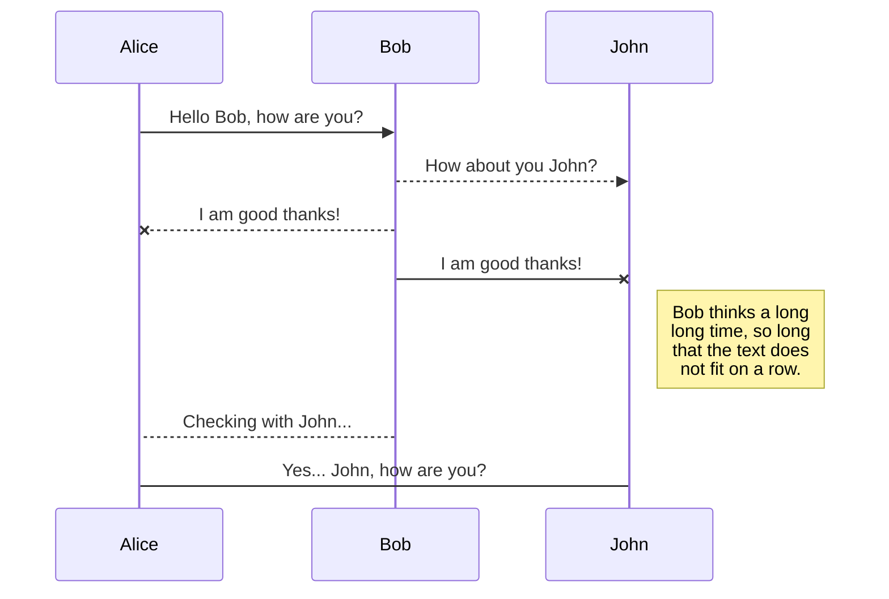
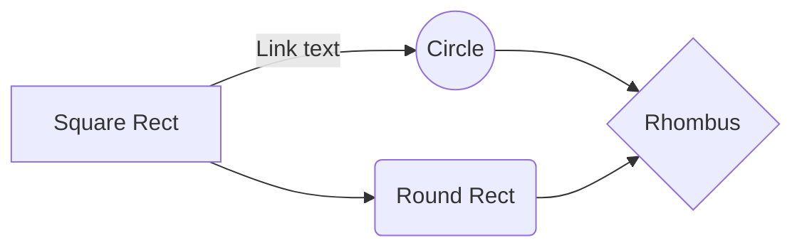

# Sonaqube Dockerfile

    FROM openjdk:8-jdk-alpine
    
    FROM sonarqube
    
    VOLUME /tmp
    
    ARG SERVER_ENV=dev
    
    ENV SERVER_ENV ${SERVER_ENV}
    
    ADD sonar-l10n-zh-plugin-1.21.jar /opt/sonarqube/extensions/plugins/
    
    ENV JAVA_OPTS="-XX:PermSize=1024m -XX:MaxPermSize=512m -Xmx4g -Xms2g"
    
    COPY ./app.jar app.jar
    
    ENTRYPOINT ["java", "-Dspring.profiles.active=${SERVER_ENV}", "-jar","/app.jar"]

# Sonaqube buile.grade

    buildscript {
    	repositories {
    		mavenCentral()
    	}
    
    dependencies {
    
	    classpath 'org.springframework.boot:spring-boot-gradle-plugin:1.5.21.RELEASE'
	   
	    classpath 'se.transmode.gradle:gradle-docker:1.2'
	    
	    classpath "org.sonarsource.scanner.gradle:sonarqube-gradle-plugin:2.6.2"
	    
	    classpath 'org.ajoberstar:gradle-jacoco:0.1.0'
    
    }
    
    }
    
    plugins {
    
    id 'java'
    
    id "org.sonarqube" version "2.5"
    
    }
    
    apply plugin: 'docker'
    
    apply plugin: 'org.springframework.boot'
    
    apply plugin: "org.sonarqube"
    
    apply plugin: 'jacoco'
    
    jacoco {
    
    toolVersion = "0.7.5.201505241946"
    
    }
    
    test {
    
    jacoco {
    
    enabled = true
    
    destinationFile = file("${buildDir}/jacoco/jacoco.exec") // 기본은 ${buildDir}/jacoco/test.exec
    
    }
    
    ignoreFailures = true
    
    }
    
    jacocoTestReport {
    
    reports {
    
    xml.enabled false
    
    csv.enabled false
    
    html.destination file("${buildDir}/jacocoHtml")
    
    }
    
    jacocoClasspath = files
    
    ('../lib/org.jacoco.core-0.7.9.jar',
    
    '../lib/org.jacoco.report-0.7.9.jar',
    
    '../lib/org.jacoco.ant-0.7.9.jar',
    
    '../lib/asm-all-5.2.jar'
    
    )
    
    }
    
    group = 'com.sicc'
    
    version = '0.0.2-SNAPSHOT'
    
    sourceCompatibility = '1.8'
    
    repositories {
    
    mavenCentral()
    
    }
    
    dependencies {
    
    compile 'org.springframework.boot:spring-boot-starter-web'
    
    providedRuntime 'org.springframework.boot:spring-boot-starter-tomcat'
    
    testCompile 'org.springframework.boot:spring-boot-starter-test'
    
    }
    
    jar {
    
    baseName = "SiccDocker"
    
    version = "${version}"
    
    from {
    
    configurations.compile.collect {
    
    it.isDirectory()?it:zipTree(it)
    
    }
    
    }
    
    }
    
    task buildDocker(type: Docker, dependsOn: build) {
    
    applicationName = jar.baseName
    
    dockerfile = file('src/main/docker/Dockerfile')
    
    doFirst {
    
    copy {
    
    from jar
    
    into stageDir
    
    }
    
    }
    
    }
    
    sonarqube {
    
    properties {
    
    property "sonar.projectName", "SiccDocker"
    
    property "sonar.projectKey", "SiccDocker"
    
    property "sonar.jacoco.reportPath", "${project.buildDir}/jacoco/test.exec"
    
    property "sonar.host.url", "http://106.10.38.30:9000"
    
    property "sonar.sources", "src/main/java"
    
    property "sonar.language", "java"
    
    property "sonar.sourceEncoding", "UTF-8"
    
    property "sonar.tests", "src/test/java"
    
    property "sonar.java.binaries", "bin"
    
    property "sonar.java.libraries", "../lib/**/*.jar"
    
    property "sonar.java.test.libraries", "../lib/**/*.jar"
    
    property "sonar.jacoco.reportPaths", "build/jacoco/test.exec"
    
    }
    
    }

## jenkinsfile

    // Jenkins file for Gradle.build
    
    node {
    
    def jarFile = ''
    
    // >>>>> checkout >>>>>>
    
    stage('checkout') {
    
    checkout(
    
    [
    
    $class: 'GitSCM',
    
    additionalCredentials: [],
    
    excludedCommitMessage: '',
    
    excludedRegions: '',
    
    excludedRevprop: '',
    
    excludedUsers: '',
    
    filterChangelog: false,
    
    ignoreDirPropChanges: false,
    
    includedRegions: '',
    
    branches: [[name: '*/master']],
    
    doGenerateSubmoduleConfigurations: false,
    
    extensions: [],
    
    submoduleCfg: [],
    
    userRemoteConfigs: [[credentialsId: '인증키', url: 'git-repo']]
    
    ]
    
    )
    
    }
    
    // >>>>> SonaQube >>>>>
    
    // sonaqube -> marketplcae -> install sonaqube:java
    
    // gradle.build -> update
    
    // jenkins/sonaqube /bash/ conf/sonaqube-sacnner.property update -> run
    
    stage('SonarQube Analysis') {
    
    withSonarQubeEnv('Sonarqube-4.0') {
    
    // sh "chmod +x ./gradlew"
    
    // sh "./gradlew -Pprod clean test sonarqube"
    
    sh "${scannerHome}/bin/sonar-scanner"
    
    }
    
    timeout(time: 10, unit: 'MINUTES') {
    
    waitForQualityGate abortPipeline: false
    
    }
    
    }
    
    // >>>>> JUNIT TEST >>>>>
    
    stage('unit-test') {
    
    sh "chmod +x ./gradlew"
    
    sh "./gradlew clean test --info"
    
    }
    
    // >>>>> gradle init >>>>>
    
    stage('initialize') {
    
    sh "chmod +x ./gradlew"
    
    appName = sh(script: "./gradlew properties -q | grep \"name\" | awk '{print\$2}'", returnStdout: true).trim()
    
    groupName = sh(script: "./gradlew properties -q | grep \"group\" | awk '{print\$2}'", returnStdout: true).trim()
    
    appVersion = sh(script: "./gradlew properties -q | grep \"version\" | awk '{print\$2}'", returnStdout: true).trim()
    
    jarFile = appName + '-' + appVersion + '.jar'
    
    echo jarFile
    
    }
    
    // >>>>> gredle build >>>>>
    
    stage('build') {
    
    sh "./gradlew build"
    
    }
    
    // >>>>> gradle archieve & docker build >>>>>
    
    stage('archieve') {
    
    parallel(
    
    "Archive Artifacts" : {
    
    archiveArtifacts artifacts: '**/build/libs/' + appName + '-' + appVersion + '.jar',
    
    fingerprint: true
    
    },
    
    "Docker ImagePush": {
    
    sh 'mv build/libs/' + jarFile + ' ./app.jar'
    
    sh 'docker container ls -a -f name=app -q | xargs -r docker container stop'
    
    sh 'docker container ls -a -f name=app -q | xargs -r docker container rm'
    
    sh 'docker rmi -f devops-reg.ncp.sicc.co.kr/app'
    
    sh 'docker image build -t app --no-cache .'
    
    sh 'docker tag app devops-reg.ncp.sicc.co.kr/app:release '
    
    sh 'docker push devops-reg.ncp.sicc.co.kr/app:release'
    
    sh 'docker run --name=app -d devops-reg.ncp.sicc.co.kr/app:release .'
    
    }
    
    )
    
    }
    
    }
    
    // Jenkinsfile for POM.xml
    
    // Install [Pipeline: Stage step] on Jenkins
    
    // Set Maven Setting On Jenkins (Maven) for Use Pipeline: Stage step
    
    node {
    
    def jarFile = ''
    
    def mvnHome = tool 'M3'
    
    // >>>>> checkout >>>>>
    
    stage('checkout') {
    
    checkout(
    
    [
    
    $class: 'GitSCM',
    
    additionalCredentials: [],
    
    excludedCommitMessage: '',
    
    excludedRegions: '',
    
    excludedRevprop: '',
    
    excludedUsers: '',
    
    filterChangelog: false,
    
    ignoreDirPropChanges: false,
    
    includedRegions: '',
    
    branches: [[name: '*/master']],
    
    doGenerateSubmoduleConfigurations: false,
    
    extensions: [],
    
    submoduleCfg: [],
    
    userRemoteConfigs: [[credentialsId: '인증키', url: 'git-repo']]
    
    ]
    
    )
    
    }
    
    // >>>>> Maven Install && JunitTest >>>>>
    
    stage('unit-test') {
    
    script {
    
    sh "'${mvnHome}/bin/mvn' -Dmaven.test.failure.ignore clean package"
    
    sh "'${mvnHome}/bin/mvn' -Dintegration-tests.skip=true -Dmaven.test.skip=true -Ddeploy-path=./deploy clean install"
    
    // def pom = readMavenPom file: 'pom.xml'
    
    // get information of pom
    
    // developmentArtifactVersion = "${pom.artifactId}-${pom.version}"
    
    // print pom.version
    
    // print pom.artifactId
    
    // print pom.name
    
    // print pom.groupId
    
    // print pom.description
    
    // execute the unit testing and collect the reports
    
    // archiveArtifacts 'target*//*.jar'
    
    }
    
    }
    
    // >>>>> Archive && Docker Build >>>>>
    
    stage('archieve') {
    
    def pom = readMavenPom file: 'pom.xml'
    
    parallel(
    
    "Archive Artifacts" : {
    
    jarFile = "${pom.artifactId}-${pom.version}.jar"
    
    archiveArtifacts artifacts: 'target/' + jarFile, fingerprint: true
    
    },
    
    "Docker ImagePush": {
    
    sh 'mv target/' + jarFile +' ./mvn2.jar'
    
    sh 'docker image build -t mvn2 .'
    
    sh 'docker tag mvn2 localhost:5000/mvn2:mvn2-1 '
    
    sh 'docker push localhost:5000/mvn2:mvn2-1'
    
    // sh 'docker run -d -p 8888:9999 app .'
    
    }
    
    )
    
    }
    
    }
    
    // Jenkinsfile for POM.xml
    
    // Install Kubernetes On Jenkins
    
    // apt-get update
    
    // apt-get install gettext-base
    
    node {
    
    def jarFile = ''
    
    def script = "; envsubst < deployment.yaml > deployment.yaml"
    
    stage('checkout') {
    
    checkout(
    
    [
    
    $class: 'GitSCM',
    
    additionalCredentials: [],
    
    excludedCommitMessage: '',
    
    excludedRegions: '',
    
    excludedRevprop: '',
    
    excludedUsers: '',
    
    filterChangelog: false,
    
    ignoreDirPropChanges: false,
    
    includedRegions: '',
    
    branches: [[name: '*/master']],
    
    doGenerateSubmoduleConfigurations: false,
    
    extensions: [],
    
    submoduleCfg: [],
    
    userRemoteConfigs: [[credentialsId: '인증키', url: 'repo']]
    
    ]
    
    )
    
    }
    
    stage('unit-test') {
    
    sh "chmod +x ./gradlew"
    
    sh "./gradlew clean test --info"
    
    }
    
    stage('initialize') {
    
    sh "chmod +x ./gradlew"
    
    appName = sh(script: "./gradlew properties -q | grep \"name\" | awk '{print\$2}'", returnStdout: true).trim()
    
    groupName = sh(script: "./gradlew properties -q | grep \"group\" | awk '{print\$2}'", returnStdout: true).trim()
    
    appVersion = sh(script: "./gradlew properties -q | grep \"version\" | awk '{print\$2}'", returnStdout: true).trim()
    
    jarFile = appName + '-' + appVersion + '.jar'
    
    }
    
    stage('build') {
    
    sh "./gradlew build"
    
    }
    
    stage('archieve & docker build') {
    
    parallel(
    
    "Archive Artifacts" : {
    
    archiveArtifacts artifacts: '**/build/libs/' + appName + '-' + appVersion + '.jar'
    
    },
    
    "Docker ImagePush": {
    
    sh 'mv build/libs/' + jarFile + ' ./app.jar'
    
    sh 'docker container ls -a -f name=app -q | xargs -r docker container stop'
    
    sh 'docker container ls -a -f name=app -q | xargs -r docker container rm'
    
    sh 'docker rmi -f devops-reg.ncp.sicc.co.kr/app'
    
    sh 'docker image build -t app --no-cache . '
    
    sh 'docker image tag app devops-reg.ncp.sicc.co.kr/app '
    
    sh 'docker image push devops-reg.ncp.sicc.co.kr/app'
    
    sh 'docker run --name=app -d -p 9091:9091 devops-reg.ncp.sicc.co.kr/app .'
    
    }
    
    )
    
    }
    
    stage('kube') {
    
    sh 'kubectl apply --record -f gs-spring-boot-docker-deployment.yaml'
    
    sh 'kubectl get deployments'
    
    sh 'kubectl get rs'
    
    sh 'kubectl get po'
    
    sh 'kubectl apply -f gs-spring-boot-docker-service.yaml'
    
    sh 'kubectl get service'
    
    sh 'kubectl get svc'
    
    sh 'kubectl set image deployment/gs-spring-boot-docker-deployment gs-spring-boot-docker=dtlabs/gs-spring-boot-docker:2.0 --record'
    
    sh 'kubectl rollout history deployment/gs-spring-boot-docker-deployment'
    
    sh 'kubectl rollout history deployment/gs-spring-boot-docker-deployment --revision=2'
    
    sh 'kubectl rollout undo deployment/gs-spring-boot-docker-deployment'
    
    sh 'kubectl rollout undo deployment/gs-spring-boot-docker-deployment --to-revision=2'
    
    }
    
    }
    
    // jenkins android
    
    node {
    
    def jarFile = ''
    
    //def script = "; envsubst < deployment.yaml > deployment.yaml"
    
    stage('checkout') {
    
    checkout(
    
    [
    
    $class: 'GitSCM',
    
    additionalCredentials: [],
    
    excludedCommitMessage: '',
    
    excludedRegions: '',
    
    excludedRevprop: '',
    
    excludedUsers: '',
    
    filterChangelog: false,
    
    ignoreDirPropChanges: false,
    
    includedRegions: '',
    
    branches: [[name: '*/master']],
    
    doGenerateSubmoduleConfigurations: false,
    
    extensions: [],
    
    submoduleCfg: [],
    
    userRemoteConfigs: [[credentialsId: 'da5d721f-6590-4f89-ba34-4704d29b01df', url: 'http://49.236.136.94:10080/devops/demo.git']]
    
    ]
    
    )
    
    }
    
    stage('unit-test') {
    
    sh "chmod +x ./gradlew"
    
    sh "./gradlew clean test --info"
    
    }
    
    stage('initialize') {
    
    sh "chmod +x ./gradlew"
    
    appName = sh(script: "./gradlew properties -q | grep \"name\" | awk '{print\$2}'", returnStdout: true).trim()
    
    groupName = sh(script: "./gradlew properties -q | grep \"group\" | awk '{print\$2}'", returnStdout: true).trim()
    
    appVersion = sh(script: "./gradlew properties -q | grep \"version\" | awk '{print\$2}'", returnStdout: true).trim()
    
    jarFile = appName + '-' + appVersion + '.jar'
    
    }
    
    stage('build') {
    
    sh "./gradlew build"
    
    }
    
    stage('archieve & docker build') {
    
    parallel(
    
    "Archive Artifacts" : {
    
    archiveArtifacts artifacts: '**/build/libs/' + appName + '-' + appVersion + '.jar'
    
    },
    
    "Docker ImagePush": {
    
    sh 'mv build/libs/' + jarFile + ' ./app.jar'
    
    sh 'docker container ls -a -f name=app -q | xargs -r docker container stop'
    
    sh 'docker container ls -a -f name=app -q | xargs -r docker container rm'
    
    // sh 'docker rmi -f devops-reg.ncp.sicc.co.kr/app'
    
    sh 'docker image build -t app --no-cache . '
    
    sh 'docker login -u pp22shj -p shjk6063'
    
    sh 'docker image tag app pp22shj/registry:app '
    
    sh 'docker image push pp22shj/registry:app'
    
    def script = "; envsubst < kubernetes.yaml > deployment.yaml"
    
    sh 'export APP_NAME=app IMAGE=pp22shj/registry:app ' + script
    
    // sh 'kubectl create namespace test'
    
    sh 'kubectl apply -f deployment.yaml --namespace test '
    
    // sh 'docker run --name=app -d -p 9091:9091 devops-reg.ncp.sicc.co.kr/app .'
    
    }
    
    )
    
    }
    
    // stage('kube') {
    
    // def script = "; envsubst < kubernetes.yaml > deployment.yaml"
    
    // sh 'export APP_NAME=app IMAGE=registry/app ' + script
    
    // sh 'kubectl apply -f deployment.yaml --namespace jiwan '
    
    // // sh 'kubectl get service --namespace jiwan'
    
    // // sh 'kubectl get svc --namespace jiwan'
    
    // // sh 'kubectl get deployments --namespace jiwan'
    
    // // sh 'kubectl get rs --namespace jiwan'
    
    // // sh 'kubectl get po --namespace jiwan'
    
    // // sh 'kubectl set image deployment/gs-spring-boot-docker-deployment gs-spring-boot-docker=dtlabs/gs-spring-boot-docker:2.0 --record'
    
    // // sh 'kubectl rollout history deployment/gs-spring-boot-docker-deployment'
    
    // // sh 'kubectl rollout history deployment/gs-spring-boot-docker-deployment --revision=2'
    
    // // sh 'kubectl rollout undo deployment/gs-spring-boot-docker-deployment'
    
    // // sh 'kubectl rollout undo deployment/gs-spring-boot-docker-deployment --to-revision=2'
    
    // }
    
    // stage('kube') {
    
    // sh 'kubectl apply --record -f gs-spring-boot-docker-deployment.yaml'
    
    // sh 'kubectl get deployments'
    
    // sh 'kubectl get rs'
    
    // sh 'kubectl get po'
    
    // sh 'kubectl apply -f gs-spring-boot-docker-service.yaml'
    
    // sh 'kubectl get service'
    
    // sh 'kubectl get svc'
    
    // sh 'kubectl set image deployment/gs-spring-boot-docker-deployment gs-spring-boot-docker=dtlabs/gs-spring-boot-docker:2.0 --record'
    
    // sh 'kubectl rollout history deployment/gs-spring-boot-docker-deployment'
    
    // sh 'kubectl rollout history deployment/gs-spring-boot-docker-deployment --revision=2'
    
    // sh 'kubectl rollout undo deployment/gs-spring-boot-docker-deployment'
    
    // sh 'kubectl rollout undo deployment/gs-spring-boot-docker-deployment --to-revision=2'
    
    // }
    
    }

## docker-compose.yml

    version: '2'
    services:
    
	    gitlab:
    
		    privileged: true
		    
		    restart: always
		    
		    image: gitlab/gitlab-ce:latest
		    
		    container_name: gitlab
		    
		    environment:
		    
		    GITLAB_OMNIBUS_CONFIG: |
		    
		    external_url 'http://106.10.38.30:10080'
		    
		    depends_on:
		    
		    - postgresql
		    
		    ports:
		    
		    - "10080:10080"
		    
		    - "10022:22"
		    
		    volumes:
		    
		    - /srv/docker/gitlab/gitlab:/home/git/data:Z
    
	    jenkins:
    
		    privileged: true
		    
		    restart: always
		    
		    image: jenkins/jenkins:lts
		    
		    container_name: jenkins
		    
		    user: root
		    
		    environment:
		    
		    JENKINS_HOST_HOME: "/data/jenkins"
		    
		    ports:
		    
		    - 8090:8080
		    
		    volumes:
		    
		    - "/data/jenkins:/var/jenkins_home"
		    
		    - "/var/run/docker.sock:/var/run/docker.sock"
		    
		    - "/usr/bin/docker:/usr/bin/docker"
		    
		    postgresql:
		    
		    privileged: true
		    
		    restart: always
		    
		    container_name: postgres
		    
		    image: postgres:latest
		    
		    ports:
		    
		    - 5432:5432
		    
		    volumes:
		    
		    - "/srv/docker/gitlab/postgresql:/var/lib/postgresql:Z"
		    
		    environment:
		    
		    - POSTGRES_USER=postgres
		    
		    - POSTGRES_PASSWORD=0811
    
	    redmine:
    
		    privileged: true
		    
		    image: redmine
		    
		    container_name: redmine
		    
		    restart: always
		    
		    ports:
		    
		    - 3000:3000
		    
		    environment:
		    
		    - DB_ADAPTER=postgresql
		    
		    - DB_HOST=106.10.38.30
		    
		    - DB_PORT=5432
		    
		    - DB_USER=postgres
		    
		    - DB_PASS=0811
		    
		    - DB_NAME=redmine
    
	    registry:
    
		    privileged: true
		    
		    restart: always
		    
		    image: registry:latest
		    
		    container_name: registry
		    
		    ports:
		    
		    - 5000:5000
		    
		    volumes:
		    
		    - "/srv/docker/registry:/var/lib/registry"
    
	    sonarqube:
    
		    image: sonarqube
		    
		    ports:
		    
		    - "9000:9000"
		    
		    networks:
		    
		    - sonarnet
		    
		    environment:
		    
		    - sonar.jdbc.url=jdbc:postgresql://db:5432/sonar
		    
		    volumes:
		    
		    - sonarqube_conf:/opt/sonarqube/conf
		    
		    - sonarqube_data:/opt/sonarqube/data
		    
		    - sonarqube_extensions:/opt/sonarqube/extensions
		    
		    db:
		    
		    image: postgres
		    
		    networks:
		    
		    - sonarnet
		    
		    environment:
		    
		    - POSTGRES_USER=sonar
		    
		    - POSTGRES_PASSWORD=sonar
		    
		    volumes:
		    
		    - postgresql:/var/lib/postgresql
		    
		    - postgresql_data:/var/lib/postgresql/data
    
    networks:
    
    sonarnet:
    
    driver: bridge
    
    volumes:
    
    sonarqube_conf:
    
    sonarqube_data:
    
    sonarqube_extensions:
    
    postgresql:
    
    postgresql_data:

# Removing All Unused Objects :

    $ docker system prune
    
    $ docker system prune --volumes

# Removing Docker Containers:

    $ docker container ls -a
    
    $ docker container rm [container name]

# Remove all stopped containers:

    $ docker container ls -a --filter status=exited --filter status=created
    
    $ docker container prune
    
    $ docker container prune --filter "until=12h"
    
    $ docker container stop $(docker container ls -aq)
    
    $ docker container rm $(docker container ls -aq)

# Removing Docker Images :

    $ docker image ls
    
    $ docker image rm [image name]
    
    $ docker rmi $(docker images -f dangling=true -q)
    
    $ docker image prune
    
    $ docker image prune -a
    
    $ docker image prune -a --filter "until=12h"

# Removing Docker Volumes :

    $ docker volume ls
    
    $ docker volume rm [volume name]
    
    $ docker volume prune

# Removing Docker Networks :

    $ docker network ls
    
    $ docker network rm [volume name]
    
    $ docker network prune
    
    $ docker network prune -a --filter "until=12h"

# Docker repository

    $ docker tag image username/repository:tagname
    
    $ docker push username/repository:tagname
    
    $ docker pull username/repository:tagname

## 1차 사내교육 자료

    0. Pre-Install For CentOS
    
    yum -y update && upgrade
    
    // ==> update && upgrade centos
    
    yum install -y java-1.8.0-openjdk.x86_64
    
    // ==> install openjdk
    
    1. Docker Install
    
    yum install -y yum-utils device-mapper-persistent-data lvm2
    
    // ==> pre-install for install docker
    
    yum-config-manager --add-repo https://download.docker.com/linux/centos/docker-ce.repo
    
    // ==> setting docker-repository
    
    yum -y install docker-ce
    
    // ==> docker install latest version
    
    systemctl enable docker && systemctl start docker
    
    // ==> enable && start docker
    
    2. docker-compose Install(install system)
    
    sudo curl -L "https://github.com/docker/compose/releases/download/1.24.1/docker-compose-$(uname -s)-$(uname -m)" -o /usr/local/bin/docker-compose
    
    // ==> docker-compose install
    
    sudo chmod +x /usr/local/bin/docker-compose
    
    // ==> docker-compose authorization
    
    3. Install GitLab/Jenkins/Postgresql/Redmine/Docker-Registry With Docker-Compose
    
    // ==> to install Devops tools with docker-compose which enable to install easy
    
    version: '2'
    
    services:
    
    gitlab:
    
    privileged: true
    
    restart: always
    
    image: gitlab/gitlab-ce:latest
    
    container_name: gitlab
    
    environment:
    
    GITLAB_OMNIBUS_CONFIG: |
    
    external_url 'http://210.89.189.207:10080'
    
    depends_on:
    
    - postgresql
    
    ports:
    
    - "10080:10080"
    
    - "10022:22"
    
    volumes:
    
    - "/srv/docker/gitlab/gitlab:/home/git/data:Z"
    
    jenkins:
    
    privileged: true
    
    restart: always
    
    image: jenkins/jenkins:lts
    
    container_name: jenkins
    
    user: root
    
    environment:
    
    JENKINS_HOST_HOME: "/data/jenkins"
    
    ports:
    
    - "8090:8080"
    
    volumes:
    
    - "/data/jenkins:/var/jenkins_home"
    
    - "/var/run/docker.sock:/var/run/docker.sock"
    
    - "/usr/bin/docker:/usr/bin/docker"
    
    postgresql:
    
    privileged: true
    
    restart: always
    
    container_name: postgres
    
    image: postgres:latest
    
    ports:
    
    - "5432:5432"
    
    volumes:
    
    - "/srv/docker/gitlab/postgresql:/var/lib/postgresql:Z"
    
    environment:
    
    - POSTGRES_USER=postgres
    
    - POSTGRES_PASSWORD=0811
    
    redmine:
    
    privileged: true
    
    image: redmine
    
    container_name: redmine
    
    restart: always
    
    ports:
    
    - "3000:3000"
    
    environment:
    
    - DB_ADAPTER=postgresql
    
    - DB_HOST=210.89.189.207
    
    - DB_PORT=5432
    
    - DB_USER=postgres
    
    - DB_PASS=0811
    
    - DB_NAME=redmine
    
    registry:
    
    privileged: true
    
    restart: always
    
    image: registry:latest
    
    container_name: registry
    
    ports:
    
    - "5000:5000"
    
    volumes:
    
    - "/srv/docker/registry:/var/lib/registry"
    
    [Docker Common Command]
    
    docker ps
    
    // ==> check the container
    
    docker ps -a
    
    // ==> check all container list
    
    docker images
    
    // ==> check images
    
    docker-compose up
    
    // ==> setup and run docker-compose with logs
    
    docker-compose up -d
    
    // ==> setup and run docker-compose with background
    
    docker-compose(docker) stop(down)
    
    // ==> shut-down docker
    
    docker stop(down) [container_name]
    
    // ==> stop container
    
    docker restart [container_name]
    
    // ==> restart container
    
    4. Jenkinsfile =>> Checkout SCM =>> Unit Test => Gradle Build =>> Make Archieve && Docker Build =>> Docker Run =>> Check Server OutPut
    
    // ==> type code with groovy to make pipeline
    
    node {
    
    def jarFile = ''
    
    stage('checkout') {
    
    checkout(
    
    [
    
    $class: 'GitSCM',
    
    additionalCredentials: [],
    
    excludedCommitMessage: '',
    
    excludedRegions: '',
    
    excludedRevprop: '',
    
    excludedUsers: '',
    
    filterChangelog: false,
    
    ignoreDirPropChanges: false,
    
    includedRegions: '',
    
    branches: [[name: '*/master']],
    
    doGenerateSubmoduleConfigurations: false,
    
    extensions: [],
    
    submoduleCfg: [],
    
    userRemoteConfigs: [[credentialsId: '인증키', url: 'http://210.89.189.207:10080/root/education.git']]
    
    ]
    
    )
    
    }
    
    stage('unit-test') {
    
    sh "chmod +x ./gradlew"
    
    sh "./gradlew clean test --info"
    
    }
    
    stage('initialize') {
    
    sh "chmod +x ./gradlew"
    
    appName = sh(script: "./gradlew properties -q | grep \"name\" | awk '{print\$2}'", returnStdout: true).trim()
    
    groupName = sh(script: "./gradlew properties -q | grep \"group\" | awk '{print\$2}'", returnStdout: true).trim()
    
    appVersion = sh(script: "./gradlew properties -q | grep \"version\" | awk '{print\$2}'", returnStdout: true).trim()
    
    jarFile = appName + '-' + appVersion + '.jar'
    
    }
    
    stage('build') {
    
    sh "./gradlew build"
    
    }
    
    stage('archieve & docker build') {
    
    parallel(
    
    "Archive Artifacts" : {
    
    archiveArtifacts artifacts: '**/build/libs/' + appName + '-' + appVersion + '.jar'
    
    },
    
    "Docker ImagePush": {
    
    sh 'mv build/libs/' + jarFile + ' ./app.jar'
    
    sh 'docker container ls -a -f name=app -q | xargs -r docker container stop'
    
    sh 'docker container ls -a -f name=app -q | xargs -r docker container rm'
    
    sh 'docker rmi -f localhost:5000/app'
    
    sh 'docker image build -t app --no-cache . '
    
    sh 'docker image tag app localhost:5000/app '
    
    sh 'docker image push localhost:5000/app'
    
    sh 'docker run --name=app -d -p 9091:9091 localhost:5000/app .'
    
    }
    
    )
    
    }
    
    }

# registry repository name

    http://host:port/v2/_catalog

# registry tag list

    http://host:port/v2/app/tags/list

# 실습 프로젝트 URL

    URL : https://github.com/devops-sicc/edusicc-step1.git
    
    ID : devops-sicc
    
    PW : jiwan8985@@
    
    E-MAIL : jiwan8985@sicc.co.kr

## Ingrss 생성 guide

    apiVersion: extensions/v1beta1
    
    kind: Ingress
    
    metadata:
    
	    name: test-ingress
	    
	    annotations:
    
		    kubernetes.io/ingress.class: nginx
		    
		    ingress.kubernetes.io/rewrite-target: /
    
    spec:
    
	    rules:
    
	    - host: devops-kibana.ncp.sicc.co.kr
    
		    http:
    
			    paths:
    
			    - path: /
    
			    backend:
    
				    serviceName: elk-kibana
    
				    servicePort: 'http'

# kubernetes-master-slave 생성 가이드 1

    0. Pre-Install
    
    yum update && upgrade
    
    yum search openjdk
    
    yum install java-1.8.0-openjdk.x86_64
    
    1. Docker-Install
    
    yum install -y yum-utils device-mapper-persistent-data lvm2
    
    yum-config-manager --add-repo https://download.docker.com/linux/centos/docker-ce.repo
    
    yum -y install docker-ce
    
    systemctl enable docker.service
    
    systemctl start docker.service
    
    systemctl status docker.service
    
    2. Docker-Compose Install
    
    sudo curl -L "https://github.com/docker/compose/releases/download/1.24.1/docker-compose-$(uname -s)-$(uname -m)" -o /usr/local/bin/docker-compose
    
    sudo chmod +x /usr/local/bin/docker-compose
    
    3. Kubernetes Install
    
    cat <<EOF > /etc/yum.repos.d/kubernetes.repo
    
    [kubernetes]
    
    name=Kubernetes
    
    baseurl=https://packages.cloud.google.com/yum/repos/kubernetes-el7-x86_64
    
    enabled=1
    
    gpgcheck=1
    
    repo_gpgcheck=1
    
    gpgkey=https://packages.cloud.google.com/yum/doc/yum-key.gpg https://packages.cloud.google.com/yum/doc/rpm-package-key.gpg
    
    EOF
    
    yum install -y kubectl
    
    4. Helm Install
    
    wget https://storage.googleapis.com/kubernetes-helm/helm-v2.13.1-linux-amd64.tar.gz
    
    tar zxvf helm-v2.13.1-linux-amd64.tar.gz
    
    sudo mv linux-amd64/helm /usr/local/bin/helm
    
    helm init : Tiller Install
    
    5. Skaffold Install
    
    curl -Lo skaffold https://storage.googleapis.com/skaffold/releases/latest/skaffold-darwin-amd64
    
    chmod +x skaffold
    
    sudo mv skaffold /usr/local/bin
    
    vim /etc/hosts
    
    127.0.0.1 localhost localhost.localdomain localhost4 localhost4.localdomain4
    
    ::1 localhost localhost.localdomain localhost6 localhost6.localdomain6
    
    10.41.172.151 devops-jw
    
    10.41.178.164 devops-test

## Kubernetes-master-slave 생성 가이드 2

    1. System update
    
    sudo yum update -y
    
    2. Install and Setup Docker
    
    sudo yum install -y docker-ce-18.09
    
    sudo systemctl enable docker && sudo systemctl start docker
    
    sudo docker version
    
    3. Install Kubernetes packages
    
    sudo bash -c 'cat <<EOF > /etc/yum.repos.d/kubernetes.repo
    
    [kubernetes]
    
    name=Kubernetes
    
    baseurl=https://packages.cloud.google.com/yum/repos/kubernetes-el7-x86_64
    
    enabled=1
    
    gpgcheck=1
    
    repo_gpgcheck=1
    
    gpgkey=https://packages.cloud.google.com/yum/doc/yum-key.gpg https://packages.cloud.google.com/yum/doc/rpm-package-key.gpg
    
    exclude=kube*
    
    EOF'
    
    4. Disable SELinux
    
    sudo setenforce 0
    
    sudo sed -i 's/^SELINUX=enforcing$/SELINUX=permissive/' /etc/selinux/config
    
    swapoff -a
    
    5. Install Kubernetes
    
    sudo yum install -y kubelet kubeadm kubectl --disableexcludes=kubernetes
    
    sudo systemctl enable kubelet && sudo systemctl start kubelet
    
    6. Set IPTables settings
    
    sudo bash -c cat <<EOF > /etc/sysctl.d/k8s.conf
    
    net.bridge.bridge-nf-call-ip6tables = 1
    
    net.bridge.bridge-nf-call-iptables = 1
    
    EOF
    
    sudo sysctl --system
    
    sudo lsmod | grep br_netfilter
    
    sudo kubeadm config images pull
    
    vim etc/hosts
    
    127.0.0.1 localhost localhost.localdomain localhost4 localhost4.localdomain4
    
    ::1 localhost localhost.localdomain localhost6 localhost6.localdomain6
    
    10.41.29.144 dev-mast
    
    10.41.179.161 dev-worker
    
    7. Master Node
    
    sudo kubeadm init --pod-network-cidr=10.244.0.0/16
    
    mkdir -p $HOME/.kube
    
    sudo cp -i /etc/kubernetes/admin.conf $HOME/.kube/config
    
    sudo chown $(id -u):$(id -g) $HOME/.kube/config
    
    kubectl apply -f https://raw.githubusercontent.com/coreos/flannel/a70459be0084506e4ec919aa1c114638878db11b/Documentation/kube-flannel.yml
    
    8. Worker node
    
    vim /usr/lib/systemd/system/docker.service
    
    ExecStart=/usr/bin/dockerd-current
    
    --add-runtime docker-runc=/usr/libexec/docker/docker-runc-current
    
    --default-runtime=docker-runc
    
    --exec-opt native.cgroupdriver=systemd // 이것만 수정해준다.( --> To change cgroupfs )
    
    --userland-proxy-path=/usr/libexec/docker/docker-proxy-current
    
    --init-path=/usr/libexec/docker/docker-init-current
    
    --seccomp-profile=/etc/docker/seccomp.json \
    
    sudo kubeadm join 10.41.29.144:6443 --token khm95w.mo0wwenu2o9hglls \
    
    --discovery-token-ca-cert-hash sha256:aeb0ca593b63c8d674719858fd2397825825cebc552e3c165f00edb9671d6e32 --v=2(skipping verify)
    
    systemctl daemon-reload
    
    systemctl restart docker
    
    kubectl --kubeconfig=kubelet.conf get nodes(check worker, master Node status ready)
    
    9. Master Node
    
    kubectl label node dev-woreker node-role.kubernetes.io/worker=worker
    
    kubectl get nodes(check worker, master Node status ready)
    
    kubectl apply -f xxx.yaml
    
    10. create service on kubectl
    
    Create a Namespace
    
    Create a deployment yaml and deploy it.
    
    Create a service yaml and deploy it.
    
    Access the Jenkins application on a Node Port.
    
    11. setup jenkins on kubectl
    
    kubectl create ns jenkins // create Namespace
    
    vim jenkins-deployment.yaml // create deployment file
    
    >>>>>>>>>>>>>>>>>>>>>>>>>>>>>jenkins-deployment.yaml>>>>>>>>>>>>>>>>>>>>>>>>>>>>>>>>>>>>>
    
    apiVersion: extensions/v1beta1
    
    kind: Deployment
    
    metadata:
    
    name: jenkins-deployment
    
    spec:
    
    replicas: 1
    
    selector:
    
    matchLabels:
    
    app: jenkins
    
    template:
    
    metadata:
    
    labels:
    
    app: jenkins
    
    spec:
    
    containers:
    
    - name: jenkins
    
    image: jenkins:2.60.3
    
    ports:
    
    - containerPort: 8080
    
    >>>>>>>>>>>>>>>>>>>>>>>>>>>>>jenkins-deployment.yaml>>>>>>>>>>>>>>>>>>>>>>>>>>>>>>>>>>>>>
    
    kubectl create -f jenkins-deployment.yaml --namespace=jenkins // create jenkins deployment
    
    kubectl describe deployments --namespace=jenkins // get deployment details
    
    vim jenkins-service.yaml // create jenkins service
    
    >>>>>>>>>>>>>>>>>>>>>>>>>>>>>jenkins-service.yaml>>>>>>>>>>>>>>>>>>>>>>>>>>>>>>>>>>>>>
    
    apiVersion: v1
    
    kind: Service
    
    metadata:
    
    name: jenkins
    
    spec:
    
    type: NodePort
    
    ports:
    
    - port: 8080
    
    targetPort: 8080
    
    nodePort: 30000
    
    selector:
    
    app: jenkins
    
    >>>>>>>>>>>>>>>>>>>>jenkins-service.yaml>>>>>>>>>>>>>>>>>>>>>>>>>>>>>>>>>>>>>
    
    kubectl create -f jenkins-service.yaml --namespace=jenkins // create jenkins service
    
    http://10.41.29.144:3000 // connect
    
    kubectl get pods --namespace=jenkins
    
    kubectl logs jenkins-deployment-868cc579df-jxq5m --namespace=jenkins // to get initialAdminPassword
    
    12. helm
    
    helm install --name my-release stable/jenkins
    
    helm status my-release
    
    helm delete --purge my-release
    
    helm list
    
    kubectl get -n kube-system secrets,sa,clusterrolebinding -o name|grep tiller|xargs kubectl -n kube-system delete
    
    kubectl get all -n kube-system -l app=helm -o name|xargs kubectl delete -n kube-system

## Save a file

You can save any file of the workspace to **Google Drive**, **Dropbox** or **GitHub** by opening the **Synchronize** sub-menu and clicking **Save on**. Even if a file in the workspace is already synced, you can save it to another location. StackEdit can sync one file with multiple locations and accounts.

## Synchronize a file

Once your file is linked to a synchronized location, StackEdit will periodically synchronize it by downloading/uploading any modification. A merge will be performed if necessary and conflicts will be resolved.

If you just have modified your file and you want to force syncing, click the **Synchronize now** button in the navigation bar.

> **Note:** The **Synchronize now** button is disabled if you have no file to synchronize.

## Manage file synchronization

Since one file can be synced with multiple locations, you can list and manage synchronized locations by clicking **File synchronization** in the **Synchronize** sub-menu. This allows you to list and remove synchronized locations that are linked to your file.

# Publication

Publishing in StackEdit makes it simple for you to publish online your files. Once you're happy with a file, you can publish it to different hosting platforms like **Blogger**, **Dropbox**, **Gist**, **GitHub**, **Google Drive**, **WordPress** and **Zendesk**. With [Handlebars templates](http://handlebarsjs.com/), you have full control over what you export.

> Before starting to publish, you must link an account in the **Publish** sub-menu.

## Publish a File

You can publish your file by opening the **Publish** sub-menu and by clicking **Publish to**. For some locations, you can choose between the following formats:

- Markdown: publish the Markdown text on a website that can interpret it (**GitHub** for instance),
- HTML: publish the file converted to HTML via a Handlebars template (on a blog for example).

## Update a publication

After publishing, StackEdit keeps your file linked to that publication which makes it easy for you to re-publish it. Once you have modified your file and you want to update your publication, click on the **Publish now** button in the navigation bar.

> **Note:** The **Publish now** button is disabled if your file has not been published yet.

## Manage file publication

Since one file can be published to multiple locations, you can list and manage publish locations by clicking **File publication** in the **Publish** sub-menu. This allows you to list and remove publication locations that are linked to your file.

# Markdown extensions

StackEdit extends the standard Markdown syntax by adding extra **Markdown extensions**, providing you with some nice features.

> **ProTip:** You can disable any **Markdown extension** in the **File properties** dialog.

## SmartyPants

SmartyPants converts ASCII punctuation characters into "smart" typographic punctuation HTML entities. For example:

|                |ASCII                          |HTML                         |
|----------------|-------------------------------|-----------------------------|
|Single backticks|`'Isn't this fun?'`            |'Isn't this fun?'            |
|Quotes          |`"Isn't this fun?"`            |"Isn't this fun?"            |
|Dashes          |`-- is en-dash, --- is em-dash`|-- is en-dash, --- is em-dash|

## KaTeX

You can render LaTeX mathematical expressions using [KaTeX](https://khan.github.io/KaTeX/):

The *Gamma function* satisfying $\Gamma(n) = (n-1)!\quad\forall n\in\mathbb N$ is via the Euler integral

$$
\Gamma(z) = \int_0^\infty t^{z-1}e^{-t}dt\,.
$$

> You can find more information about **LaTeX** mathematical expressions [here](http://meta.math.stackexchange.com/questions/5020/mathjax-basic-tutorial-and-quick-reference).

## UML diagrams

You can render UML diagrams using [Mermaid](https://mermaidjs.github.io/). For example, this will produce a sequence diagram:

And this will produce a flow chart:

<!--stackedit_data:
eyJoaXN0b3J5IjpbLTE0NTM3MjcxNDldfQ==
-->