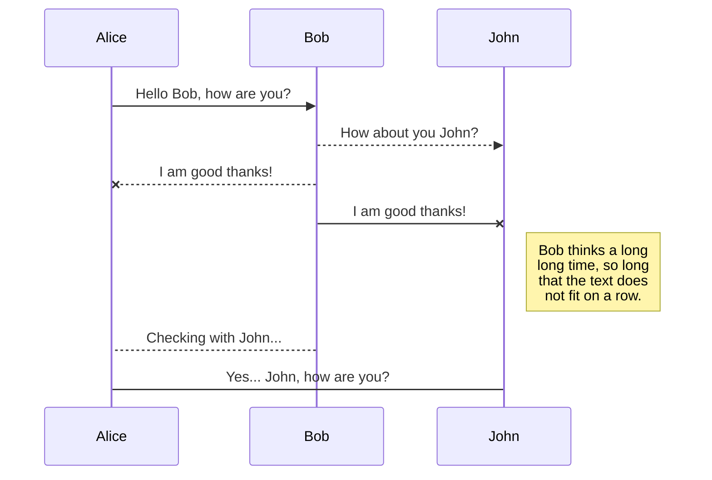
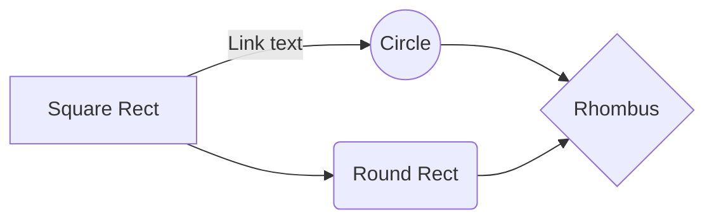

# Sonaqube Dockerfile

    FROM openjdk:8-jdk-alpine
    
    FROM sonarqube
    
    VOLUME /tmp
    
    ARG SERVER_ENV=dev
    
    ENV SERVER_ENV ${SERVER_ENV}
    
    ADD sonar-l10n-zh-plugin-1.21.jar /opt/sonarqube/extensions/plugins/
    
    ENV JAVA_OPTS="-XX:PermSize=1024m -XX:MaxPermSize=512m -Xmx4g -Xms2g"
    
    COPY ./app.jar app.jar
    
    ENTRYPOINT ["java", "-Dspring.profiles.active=${SERVER_ENV}", "-jar","/app.jar"]

# Sonaqube buile.grade

    buildscript {
    	repositories {
    		mavenCentral()
    	}
    
    dependencies {
    
	    classpath 'org.springframework.boot:spring-boot-gradle-plugin:1.5.21.RELEASE'
	   
	    classpath 'se.transmode.gradle:gradle-docker:1.2'
	    
	    classpath "org.sonarsource.scanner.gradle:sonarqube-gradle-plugin:2.6.2"
	    
	    classpath 'org.ajoberstar:gradle-jacoco:0.1.0'
    
    }
    
    }
    
    plugins {
    
    id 'java'
    
    id "org.sonarqube" version "2.5"
    
    }
    
    apply plugin: 'docker'
    
    apply plugin: 'org.springframework.boot'
    
    apply plugin: "org.sonarqube"
    
    apply plugin: 'jacoco'
    
    jacoco {
    
    toolVersion = "0.7.5.201505241946"
    
    }
    
    test {
    
    jacoco {
    
    enabled = true
    
    destinationFile = file("${buildDir}/jacoco/jacoco.exec") // 기본은 ${buildDir}/jacoco/test.exec
    
    }
    
    ignoreFailures = true
    
    }
    
    jacocoTestReport {
    
    reports {
    
    xml.enabled false
    
    csv.enabled false
    
    html.destination file("${buildDir}/jacocoHtml")
    
    }
    
    jacocoClasspath = files
    
    ('../lib/org.jacoco.core-0.7.9.jar',
    
    '../lib/org.jacoco.report-0.7.9.jar',
    
    '../lib/org.jacoco.ant-0.7.9.jar',
    
    '../lib/asm-all-5.2.jar'
    
    )
    
    }
    
    group = 'com.sicc'
    
    version = '0.0.2-SNAPSHOT'
    
    sourceCompatibility = '1.8'
    
    repositories {
    
    mavenCentral()
    
    }
    
    dependencies {
    
    compile 'org.springframework.boot:spring-boot-starter-web'
    
    providedRuntime 'org.springframework.boot:spring-boot-starter-tomcat'
    
    testCompile 'org.springframework.boot:spring-boot-starter-test'
    
    }
    
    jar {
    
    baseName = "SiccDocker"
    
    version = "${version}"
    
    from {
    
    configurations.compile.collect {
    
    it.isDirectory()?it:zipTree(it)
    
    }
    
    }
    
    }
    
    task buildDocker(type: Docker, dependsOn: build) {
    
    applicationName = jar.baseName
    
    dockerfile = file('src/main/docker/Dockerfile')
    
    doFirst {
    
    copy {
    
    from jar
    
    into stageDir
    
    }
    
    }
    
    }
    
    sonarqube {
    
    properties {
    
    property "sonar.projectName", "SiccDocker"
    
    property "sonar.projectKey", "SiccDocker"
    
    property "sonar.jacoco.reportPath", "${project.buildDir}/jacoco/test.exec"
    
    property "sonar.host.url", "http://106.10.38.30:9000"
    
    property "sonar.sources", "src/main/java"
    
    property "sonar.language", "java"
    
    property "sonar.sourceEncoding", "UTF-8"
    
    property "sonar.tests", "src/test/java"
    
    property "sonar.java.binaries", "bin"
    
    property "sonar.java.libraries", "../lib/**/*.jar"
    
    property "sonar.java.test.libraries", "../lib/**/*.jar"
    
    property "sonar.jacoco.reportPaths", "build/jacoco/test.exec"
    
    }
    
    }

## jenkinsfile

    // Jenkins file for Gradle.build
    
    node {
    
    def jarFile = ''
    
    // >>>>> checkout >>>>>>
    
    stage('checkout') {
    
    checkout(
    
    [
    
    $class: 'GitSCM',
    
    additionalCredentials: [],
    
    excludedCommitMessage: '',
    
    excludedRegions: '',
    
    excludedRevprop: '',
    
    excludedUsers: '',
    
    filterChangelog: false,
    
    ignoreDirPropChanges: false,
    
    includedRegions: '',
    
    branches: [[name: '*/master']],
    
    doGenerateSubmoduleConfigurations: false,
    
    extensions: [],
    
    submoduleCfg: [],
    
    userRemoteConfigs: [[credentialsId: '인증키', url: 'git-repo']]
    
    ]
    
    )
    
    }
    
    // >>>>> SonaQube >>>>>
    
    // sonaqube -> marketplcae -> install sonaqube:java
    
    // gradle.build -> update
    
    // jenkins/sonaqube /bash/ conf/sonaqube-sacnner.property update -> run
    
    stage('SonarQube Analysis') {
    
    withSonarQubeEnv('Sonarqube-4.0') {
    
    // sh "chmod +x ./gradlew"
    
    // sh "./gradlew -Pprod clean test sonarqube"
    
    sh "${scannerHome}/bin/sonar-scanner"
    
    }
    
    timeout(time: 10, unit: 'MINUTES') {
    
    waitForQualityGate abortPipeline: false
    
    }
    
    }
    
    // >>>>> JUNIT TEST >>>>>
    
    stage('unit-test') {
    
    sh "chmod +x ./gradlew"
    
    sh "./gradlew clean test --info"
    
    }
    
    // >>>>> gradle init >>>>>
    
    stage('initialize') {
    
    sh "chmod +x ./gradlew"
    
    appName = sh(script: "./gradlew properties -q | grep \"name\" | awk '{print\$2}'", returnStdout: true).trim()
    
    groupName = sh(script: "./gradlew properties -q | grep \"group\" | awk '{print\$2}'", returnStdout: true).trim()
    
    appVersion = sh(script: "./gradlew properties -q | grep \"version\" | awk '{print\$2}'", returnStdout: true).trim()
    
    jarFile = appName + '-' + appVersion + '.jar'
    
    echo jarFile
    
    }
    
    // >>>>> gredle build >>>>>
    
    stage('build') {
    
    sh "./gradlew build"
    
    }
    
    // >>>>> gradle archieve & docker build >>>>>
    
    stage('archieve') {
    
    parallel(
    
    "Archive Artifacts" : {
    
    archiveArtifacts artifacts: '**/build/libs/' + appName + '-' + appVersion + '.jar',
    
    fingerprint: true
    
    },
    
    "Docker ImagePush": {
    
    sh 'mv build/libs/' + jarFile + ' ./app.jar'
    
    sh 'docker container ls -a -f name=app -q | xargs -r docker container stop'
    
    sh 'docker container ls -a -f name=app -q | xargs -r docker container rm'
    
    sh 'docker rmi -f devops-reg.ncp.sicc.co.kr/app'
    
    sh 'docker image build -t app --no-cache .'
    
    sh 'docker tag app devops-reg.ncp.sicc.co.kr/app:release '
    
    sh 'docker push devops-reg.ncp.sicc.co.kr/app:release'
    
    sh 'docker run --name=app -d devops-reg.ncp.sicc.co.kr/app:release .'
    
    }
    
    )
    
    }
    
    }
    
    // Jenkinsfile for POM.xml
    
    // Install [Pipeline: Stage step] on Jenkins
    
    // Set Maven Setting On Jenkins (Maven) for Use Pipeline: Stage step
    
    node {
    
    def jarFile = ''
    
    def mvnHome = tool 'M3'
    
    // >>>>> checkout >>>>>
    
    stage('checkout') {
    
    checkout(
    
    [
    
    $class: 'GitSCM',
    
    additionalCredentials: [],
    
    excludedCommitMessage: '',
    
    excludedRegions: '',
    
    excludedRevprop: '',
    
    excludedUsers: '',
    
    filterChangelog: false,
    
    ignoreDirPropChanges: false,
    
    includedRegions: '',
    
    branches: [[name: '*/master']],
    
    doGenerateSubmoduleConfigurations: false,
    
    extensions: [],
    
    submoduleCfg: [],
    
    userRemoteConfigs: [[credentialsId: '인증키', url: 'git-repo']]
    
    ]
    
    )
    
    }
    
    // >>>>> Maven Install && JunitTest >>>>>
    
    stage('unit-test') {
    
    script {
    
    sh "'${mvnHome}/bin/mvn' -Dmaven.test.failure.ignore clean package"
    
    sh "'${mvnHome}/bin/mvn' -Dintegration-tests.skip=true -Dmaven.test.skip=true -Ddeploy-path=./deploy clean install"
    
    // def pom = readMavenPom file: 'pom.xml'
    
    // get information of pom
    
    // developmentArtifactVersion = "${pom.artifactId}-${pom.version}"
    
    // print pom.version
    
    // print pom.artifactId
    
    // print pom.name
    
    // print pom.groupId
    
    // print pom.description
    
    // execute the unit testing and collect the reports
    
    // archiveArtifacts 'target*//*.jar'
    
    }
    
    }
    
    // >>>>> Archive && Docker Build >>>>>
    
    stage('archieve') {
    
    def pom = readMavenPom file: 'pom.xml'
    
    parallel(
    
    "Archive Artifacts" : {
    
    jarFile = "${pom.artifactId}-${pom.version}.jar"
    
    archiveArtifacts artifacts: 'target/' + jarFile, fingerprint: true
    
    },
    
    "Docker ImagePush": {
    
    sh 'mv target/' + jarFile +' ./mvn2.jar'
    
    sh 'docker image build -t mvn2 .'
    
    sh 'docker tag mvn2 localhost:5000/mvn2:mvn2-1 '
    
    sh 'docker push localhost:5000/mvn2:mvn2-1'
    
    // sh 'docker run -d -p 8888:9999 app .'
    
    }
    
    )
    
    }
    
    }
    
    // Jenkinsfile for POM.xml
    
    // Install Kubernetes On Jenkins
    
    // apt-get update
    
    // apt-get install gettext-base
    
    node {
    
    def jarFile = ''
    
    def script = "; envsubst < deployment.yaml > deployment.yaml"
    
    stage('checkout') {
    
    checkout(
    
    [
    
    $class: 'GitSCM',
    
    additionalCredentials: [],
    
    excludedCommitMessage: '',
    
    excludedRegions: '',
    
    excludedRevprop: '',
    
    excludedUsers: '',
    
    filterChangelog: false,
    
    ignoreDirPropChanges: false,
    
    includedRegions: '',
    
    branches: [[name: '*/master']],
    
    doGenerateSubmoduleConfigurations: false,
    
    extensions: [],
    
    submoduleCfg: [],
    
    userRemoteConfigs: [[credentialsId: '인증키', url: 'repo']]
    
    ]
    
    )
    
    }
    
    stage('unit-test') {
    
    sh "chmod +x ./gradlew"
    
    sh "./gradlew clean test --info"
    
    }
    
    stage('initialize') {
    
    sh "chmod +x ./gradlew"
    
    appName = sh(script: "./gradlew properties -q | grep \"name\" | awk '{print\$2}'", returnStdout: true).trim()
    
    groupName = sh(script: "./gradlew properties -q | grep \"group\" | awk '{print\$2}'", returnStdout: true).trim()
    
    appVersion = sh(script: "./gradlew properties -q | grep \"version\" | awk '{print\$2}'", returnStdout: true).trim()
    
    jarFile = appName + '-' + appVersion + '.jar'
    
    }
    
    stage('build') {
    
    sh "./gradlew build"
    
    }
    
    stage('archieve & docker build') {
    
    parallel(
    
    "Archive Artifacts" : {
    
    archiveArtifacts artifacts: '**/build/libs/' + appName + '-' + appVersion + '.jar'
    
    },
    
    "Docker ImagePush": {
    
    sh 'mv build/libs/' + jarFile + ' ./app.jar'
    
    sh 'docker container ls -a -f name=app -q | xargs -r docker container stop'
    
    sh 'docker container ls -a -f name=app -q | xargs -r docker container rm'
    
    sh 'docker rmi -f devops-reg.ncp.sicc.co.kr/app'
    
    sh 'docker image build -t app --no-cache . '
    
    sh 'docker image tag app devops-reg.ncp.sicc.co.kr/app '
    
    sh 'docker image push devops-reg.ncp.sicc.co.kr/app'
    
    sh 'docker run --name=app -d -p 9091:9091 devops-reg.ncp.sicc.co.kr/app .'
    
    }
    
    )
    
    }
    
    stage('kube') {
    
    sh 'kubectl apply --record -f gs-spring-boot-docker-deployment.yaml'
    
    sh 'kubectl get deployments'
    
    sh 'kubectl get rs'
    
    sh 'kubectl get po'
    
    sh 'kubectl apply -f gs-spring-boot-docker-service.yaml'
    
    sh 'kubectl get service'
    
    sh 'kubectl get svc'
    
    sh 'kubectl set image deployment/gs-spring-boot-docker-deployment gs-spring-boot-docker=dtlabs/gs-spring-boot-docker:2.0 --record'
    
    sh 'kubectl rollout history deployment/gs-spring-boot-docker-deployment'
    
    sh 'kubectl rollout history deployment/gs-spring-boot-docker-deployment --revision=2'
    
    sh 'kubectl rollout undo deployment/gs-spring-boot-docker-deployment'
    
    sh 'kubectl rollout undo deployment/gs-spring-boot-docker-deployment --to-revision=2'
    
    }
    
    }
    
    // jenkins android
    
    node {
    
    def jarFile = ''
    
    //def script = "; envsubst < deployment.yaml > deployment.yaml"
    
    stage('checkout') {
    
    checkout(
    
    [
    
    $class: 'GitSCM',
    
    additionalCredentials: [],
    
    excludedCommitMessage: '',
    
    excludedRegions: '',
    
    excludedRevprop: '',
    
    excludedUsers: '',
    
    filterChangelog: false,
    
    ignoreDirPropChanges: false,
    
    includedRegions: '',
    
    branches: [[name: '*/master']],
    
    doGenerateSubmoduleConfigurations: false,
    
    extensions: [],
    
    submoduleCfg: [],
    
    userRemoteConfigs: [[credentialsId: 'da5d721f-6590-4f89-ba34-4704d29b01df', url: 'http://49.236.136.94:10080/devops/demo.git']]
    
    ]
    
    )
    
    }
    
    stage('unit-test') {
    
    sh "chmod +x ./gradlew"
    
    sh "./gradlew clean test --info"
    
    }
    
    stage('initialize') {
    
    sh "chmod +x ./gradlew"
    
    appName = sh(script: "./gradlew properties -q | grep \"name\" | awk '{print\$2}'", returnStdout: true).trim()
    
    groupName = sh(script: "./gradlew properties -q | grep \"group\" | awk '{print\$2}'", returnStdout: true).trim()
    
    appVersion = sh(script: "./gradlew properties -q | grep \"version\" | awk '{print\$2}'", returnStdout: true).trim()
    
    jarFile = appName + '-' + appVersion + '.jar'
    
    }
    
    stage('build') {
    
    sh "./gradlew build"
    
    }
    
    stage('archieve & docker build') {
    
    parallel(
    
    "Archive Artifacts" : {
    
    archiveArtifacts artifacts: '**/build/libs/' + appName + '-' + appVersion + '.jar'
    
    },
    
    "Docker ImagePush": {
    
    sh 'mv build/libs/' + jarFile + ' ./app.jar'
    
    sh 'docker container ls -a -f name=app -q | xargs -r docker container stop'
    
    sh 'docker container ls -a -f name=app -q | xargs -r docker container rm'
    
    // sh 'docker rmi -f devops-reg.ncp.sicc.co.kr/app'
    
    sh 'docker image build -t app --no-cache . '
    
    sh 'docker login -u pp22shj -p shjk6063'
    
    sh 'docker image tag app pp22shj/registry:app '
    
    sh 'docker image push pp22shj/registry:app'
    
    def script = "; envsubst < kubernetes.yaml > deployment.yaml"
    
    sh 'export APP_NAME=app IMAGE=pp22shj/registry:app ' + script
    
    // sh 'kubectl create namespace test'
    
    sh 'kubectl apply -f deployment.yaml --namespace test '
    
    // sh 'docker run --name=app -d -p 9091:9091 devops-reg.ncp.sicc.co.kr/app .'
    
    }
    
    )
    
    }
    
    // stage('kube') {
    
    // def script = "; envsubst < kubernetes.yaml > deployment.yaml"
    
    // sh 'export APP_NAME=app IMAGE=registry/app ' + script
    
    // sh 'kubectl apply -f deployment.yaml --namespace jiwan '
    
    // // sh 'kubectl get service --namespace jiwan'
    
    // // sh 'kubectl get svc --namespace jiwan'
    
    // // sh 'kubectl get deployments --namespace jiwan'
    
    // // sh 'kubectl get rs --namespace jiwan'
    
    // // sh 'kubectl get po --namespace jiwan'
    
    // // sh 'kubectl set image deployment/gs-spring-boot-docker-deployment gs-spring-boot-docker=dtlabs/gs-spring-boot-docker:2.0 --record'
    
    // // sh 'kubectl rollout history deployment/gs-spring-boot-docker-deployment'
    
    // // sh 'kubectl rollout history deployment/gs-spring-boot-docker-deployment --revision=2'
    
    // // sh 'kubectl rollout undo deployment/gs-spring-boot-docker-deployment'
    
    // // sh 'kubectl rollout undo deployment/gs-spring-boot-docker-deployment --to-revision=2'
    
    // }
    
    // stage('kube') {
    
    // sh 'kubectl apply --record -f gs-spring-boot-docker-deployment.yaml'
    
    // sh 'kubectl get deployments'
    
    // sh 'kubectl get rs'
    
    // sh 'kubectl get po'
    
    // sh 'kubectl apply -f gs-spring-boot-docker-service.yaml'
    
    // sh 'kubectl get service'
    
    // sh 'kubectl get svc'
    
    // sh 'kubectl set image deployment/gs-spring-boot-docker-deployment gs-spring-boot-docker=dtlabs/gs-spring-boot-docker:2.0 --record'
    
    // sh 'kubectl rollout history deployment/gs-spring-boot-docker-deployment'
    
    // sh 'kubectl rollout history deployment/gs-spring-boot-docker-deployment --revision=2'
    
    // sh 'kubectl rollout undo deployment/gs-spring-boot-docker-deployment'
    
    // sh 'kubectl rollout undo deployment/gs-spring-boot-docker-deployment --to-revision=2'
    
    // }
    
    }

## docker-compose.yml

    version: '2'
    services:
    
	    gitlab:
    
		    privileged: true
		    
		    restart: always
		    
		    image: gitlab/gitlab-ce:latest
		    
		    container_name: gitlab
		    
		    environment:
		    
		    GITLAB_OMNIBUS_CONFIG: |
		    
		    external_url 'http://106.10.38.30:10080'
		    
		    depends_on:
		    
		    - postgresql
		    
		    ports:
		    
		    - "10080:10080"
		    
		    - "10022:22"
		    
		    volumes:
		    
		    - /srv/docker/gitlab/gitlab:/home/git/data:Z
    
	    jenkins:
    
		    privileged: true
		    
		    restart: always
		    
		    image: jenkins/jenkins:lts
		    
		    container_name: jenkins
		    
		    user: root
		    
		    environment:
		    
		    JENKINS_HOST_HOME: "/data/jenkins"
		    
		    ports:
		    
		    - 8090:8080
		    
		    volumes:
		    
		    - "/data/jenkins:/var/jenkins_home"
		    
		    - "/var/run/docker.sock:/var/run/docker.sock"
		    
		    - "/usr/bin/docker:/usr/bin/docker"
		    
		    postgresql:
		    
		    privileged: true
		    
		    restart: always
		    
		    container_name: postgres
		    
		    image: postgres:latest
		    
		    ports:
		    
		    - 5432:5432
		    
		    volumes:
		    
		    - "/srv/docker/gitlab/postgresql:/var/lib/postgresql:Z"
		    
		    environment:
		    
		    - POSTGRES_USER=postgres
		    
		    - POSTGRES_PASSWORD=0811
    
	    redmine:
    
		    privileged: true
		    
		    image: redmine
		    
		    container_name: redmine
		    
		    restart: always
		    
		    ports:
		    
		    - 3000:3000
		    
		    environment:
		    
		    - DB_ADAPTER=postgresql
		    
		    - DB_HOST=106.10.38.30
		    
		    - DB_PORT=5432
		    
		    - DB_USER=postgres
		    
		    - DB_PASS=0811
		    
		    - DB_NAME=redmine
    
	    registry:
    
		    privileged: true
		    
		    restart: always
		    
		    image: registry:latest
		    
		    container_name: registry
		    
		    ports:
		    
		    - 5000:5000
		    
		    volumes:
		    
		    - "/srv/docker/registry:/var/lib/registry"
    
	    sonarqube:
    
		    image: sonarqube
		    
		    ports:
		    
		    - "9000:9000"
		    
		    networks:
		    
		    - sonarnet
		    
		    environment:
		    
		    - sonar.jdbc.url=jdbc:postgresql://db:5432/sonar
		    
		    volumes:
		    
		    - sonarqube_conf:/opt/sonarqube/conf
		    
		    - sonarqube_data:/opt/sonarqube/data
		    
		    - sonarqube_extensions:/opt/sonarqube/extensions
		    
		    db:
		    
		    image: postgres
		    
		    networks:
		    
		    - sonarnet
		    
		    environment:
		    
		    - POSTGRES_USER=sonar
		    
		    - POSTGRES_PASSWORD=sonar
		    
		    volumes:
		    
		    - postgresql:/var/lib/postgresql
		    
		    - postgresql_data:/var/lib/postgresql/data
    
    networks:
    
    sonarnet:
    
    driver: bridge
    
    volumes:
    
    sonarqube_conf:
    
    sonarqube_data:
    
    sonarqube_extensions:
    
    postgresql:
    
    postgresql_data:

## Rename a file

You can rename the current file by clicking the file name in the navigation bar or by clicking the **Rename** button in the file explorer.

## Delete a file

You can delete the current file by clicking the **Remove** button in the file explorer. The file will be moved into the **Trash** folder and automatically deleted after 7 days of inactivity.

## Export a file

You can export the current file by clicking **Export to disk** in the menu. You can choose to export the file as plain Markdown, as HTML using a Handlebars template or as a PDF.

# Synchronization

Synchronization is one of the biggest features of StackEdit. It enables you to synchronize any file in your workspace with other files stored in your **Google Drive**, your **Dropbox** and your **GitHub** accounts. This allows you to keep writing on other devices, collaborate with people you share the file with, integrate easily into your workflow... The synchronization mechanism takes place every minute in the background, downloading, merging, and uploading file modifications.

There are two types of synchronization and they can complement each other:

- The workspace synchronization will sync all your files, folders and settings automatically. This will allow you to fetch your workspace on any other device.
	> To start syncing your workspace, just sign in with Google in the menu.

- The file synchronization will keep one file of the workspace synced with one or multiple files in **Google Drive**, **Dropbox** or **GitHub**.
	> Before starting to sync files, you must link an account in the **Synchronize** sub-menu.

## Open a file

You can open a file from **Google Drive**, **Dropbox** or **GitHub** by opening the **Synchronize** sub-menu and clicking **Open from**. Once opened in the workspace, any modification in the file will be automatically synced.

## Save a file

You can save any file of the workspace to **Google Drive**, **Dropbox** or **GitHub** by opening the **Synchronize** sub-menu and clicking **Save on**. Even if a file in the workspace is already synced, you can save it to another location. StackEdit can sync one file with multiple locations and accounts.

## Synchronize a file

Once your file is linked to a synchronized location, StackEdit will periodically synchronize it by downloading/uploading any modification. A merge will be performed if necessary and conflicts will be resolved.

If you just have modified your file and you want to force syncing, click the **Synchronize now** button in the navigation bar.

> **Note:** The **Synchronize now** button is disabled if you have no file to synchronize.

## Manage file synchronization

Since one file can be synced with multiple locations, you can list and manage synchronized locations by clicking **File synchronization** in the **Synchronize** sub-menu. This allows you to list and remove synchronized locations that are linked to your file.

# Publication

Publishing in StackEdit makes it simple for you to publish online your files. Once you're happy with a file, you can publish it to different hosting platforms like **Blogger**, **Dropbox**, **Gist**, **GitHub**, **Google Drive**, **WordPress** and **Zendesk**. With [Handlebars templates](http://handlebarsjs.com/), you have full control over what you export.

> Before starting to publish, you must link an account in the **Publish** sub-menu.

## Publish a File

You can publish your file by opening the **Publish** sub-menu and by clicking **Publish to**. For some locations, you can choose between the following formats:

- Markdown: publish the Markdown text on a website that can interpret it (**GitHub** for instance),
- HTML: publish the file converted to HTML via a Handlebars template (on a blog for example).

## Update a publication

After publishing, StackEdit keeps your file linked to that publication which makes it easy for you to re-publish it. Once you have modified your file and you want to update your publication, click on the **Publish now** button in the navigation bar.

> **Note:** The **Publish now** button is disabled if your file has not been published yet.

## Manage file publication

Since one file can be published to multiple locations, you can list and manage publish locations by clicking **File publication** in the **Publish** sub-menu. This allows you to list and remove publication locations that are linked to your file.

# Markdown extensions

StackEdit extends the standard Markdown syntax by adding extra **Markdown extensions**, providing you with some nice features.

> **ProTip:** You can disable any **Markdown extension** in the **File properties** dialog.

## SmartyPants

SmartyPants converts ASCII punctuation characters into "smart" typographic punctuation HTML entities. For example:

|                |ASCII                          |HTML                         |
|----------------|-------------------------------|-----------------------------|
|Single backticks|`'Isn't this fun?'`            |'Isn't this fun?'            |
|Quotes          |`"Isn't this fun?"`            |"Isn't this fun?"            |
|Dashes          |`-- is en-dash, --- is em-dash`|-- is en-dash, --- is em-dash|

## KaTeX

You can render LaTeX mathematical expressions using [KaTeX](https://khan.github.io/KaTeX/):

The *Gamma function* satisfying $\Gamma(n) = (n-1)!\quad\forall n\in\mathbb N$ is via the Euler integral

$$
\Gamma(z) = \int_0^\infty t^{z-1}e^{-t}dt\,.
$$

> You can find more information about **LaTeX** mathematical expressions [here](http://meta.math.stackexchange.com/questions/5020/mathjax-basic-tutorial-and-quick-reference).

## UML diagrams

You can render UML diagrams using [Mermaid](https://mermaidjs.github.io/). For example, this will produce a sequence diagram:

And this will produce a flow chart:

<!--stackedit_data:
eyJoaXN0b3J5IjpbMTMzODkwMzYzOV19
-->